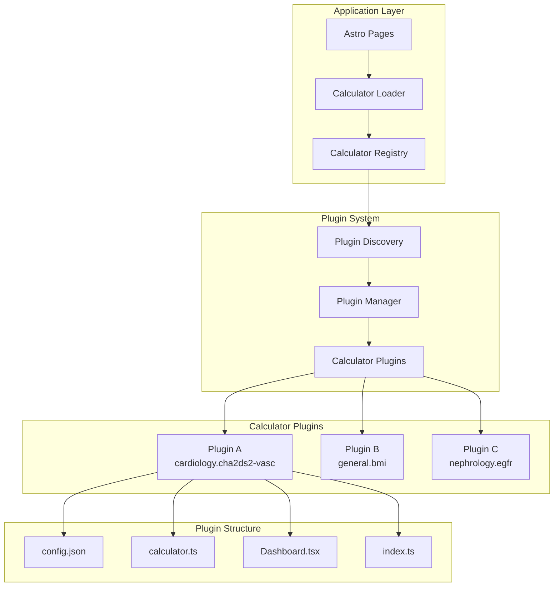

# Calculator Architecture Refactor Design

## Overview

This design document outlines the architecture for refactoring the current centralized calculator system into a decentralized, plugin-based architecture. The new system will eliminate the bottlenecks and conflicts present in the current `ModularCalculatorLoader` by implementing self-registering, namespace-isolated calculator plugins.

**Current Technology Stack:**
- **Frontend Framework**: Astro with React islands
- **UI Components**: React (.tsx files)
- **Calculator Logic**: TypeScript modules
- **Current Architecture**: Centralized `ModularCalculatorLoader` with hardcoded mappings

**Key Issues to Solve:**
1. Central bottleneck in `ModularCalculatorLoader`
2. Hardcoded `idToFolderMap` requiring manual updates
3. Manual dashboard component registration in `loadDashboardComponent`
4. Potential naming conflicts between calculators
5. Tight coupling between core system and individual calculators

**Rendering Strategy:**
Initially, the project will primarily leverage Static Site Generation (SSG) for all calculator functionalities and static content. This approach ensures maximum performance, robust SEO, and cost-effective hosting for the current frontend-only setup. The architecture is explicitly designed to seamlessly integrate with Server-Side Rendering (SSR) or a dedicated backend in the future as dynamic data or personalized features become necessary.

The design follows an MVP (Minimum Viable Product) approach, prioritizing calculator isolation and independence while maintaining compatibility with the existing React-based UI components.

## Architecture

### High-Level Architecture



### Core Principles

1. **Plugin Independence**: Each calculator operates as a self-contained plugin
2. **Namespace Isolation**: Calculators use namespaced IDs to prevent conflicts
3. **Self-Registration**: Plugins register themselves without modifying core code
4. **Error Isolation**: Plugin failures don't affect other plugins or the system
5. **Lazy Loading**: Plugins load on-demand to optimize performance
6. **SSG First, SSR/Backend Ready**: Prioritize Static Site Generation for all content and calculator display in the current pure frontend environment. Design components and data fetching patterns to allow for a smooth transition to Server-Side Rendering or integration with a dedicated backend when dynamic or personalized data is required.

## Components and Interfaces

### 1. Plugin Interface

```typescript
// src/types/calculator-plugin.ts
export interface CalculatorMetadata {
  id: string;
  namespace: string;
  version: string;
  name: Record<SupportedLocale, string>;
  description: Record<SupportedLocale, string>;
  author: string;
  license: string;
  dependencies: string[];
  conflicts: string[];
  tags: string[];
}

export interface CalculatorPlugin {
  metadata: CalculatorMetadata;
  config: CalculatorConfig;
  calculator: CalculatorImplementation;
  dashboard?: React.ComponentType<any>;
  
  // Lifecycle hooks
  install(): Promise<void>;
  uninstall(): Promise<void>;
  validate(): Promise<boolean>;
}

export interface PluginLoadResult {
  success: boolean;
  plugin?: CalculatorPlugin;
  error?: string;
}
```

### 2. Calculator Registry

The registry serves as the central repository for all loaded calculator plugins.

```typescript
// src/utils/calculator-registry.ts
export class CalculatorRegistry {
  private static plugins = new Map<string, CalculatorPlugin>();
  private static namespaces = new Map<string, Set<string>>();
  private static loadingPromises = new Map<string, Promise<PluginLoadResult>>();
  
  /**
   * Register a calculator plugin
   */
  static async register(plugin: CalculatorPlugin): Promise<void> {
    const fullId = `${plugin.metadata.namespace}.${plugin.metadata.id}`;
    
    // Version-based conflict resolution
    const existingPlugin = this.plugins.get(fullId);
    if (existingPlugin) {
      // Compare versions - only allow registration if new version is strictly higher
      const existingVersion = this.parseVersion(existingPlugin.metadata.version);
      const newVersion = this.parseVersion(plugin.metadata.version);
      
      if (this.compareVersions(newVersion, existingVersion) <= 0) {
        throw new PluginConflictError(
          `Calculator ${fullId} version ${plugin.metadata.version} is not higher than existing version ${existingPlugin.metadata.version}`
        );
      }
      
      // Unload existing version before registering new one
      await this.unregister(fullId);
      console.log(`🔄 Upgraded calculator plugin: ${fullId} from ${existingPlugin.metadata.version} to ${plugin.metadata.version}`);
    }
    
    // Dependency validation
    await this.validateDependencies(plugin);
    
    // Plugin validation
    if (!(await plugin.validate())) {
      throw new PluginValidationError(`Plugin ${fullId} validation failed`);
    }
    
    // Install plugin
    await plugin.install();
    
    // Register plugin
    this.plugins.set(fullId, plugin);
    this.ensureNamespace(plugin.metadata.namespace);
    this.namespaces.get(plugin.metadata.namespace)!.add(plugin.metadata.id);
    
    console.log(`✅ Registered calculator plugin: ${fullId}`);
  }
  
  /**
   * Get a plugin by full ID
   */
  static get(fullId: string): CalculatorPlugin | null {
    return this.plugins.get(fullId) || null;
  }
  
  /**
   * Get all plugins in a namespace
   */
  static getByNamespace(namespace: string): CalculatorPlugin[] {
    const ids = this.namespaces.get(namespace) || new Set();
    return Array.from(ids)
      .map(id => this.plugins.get(`${namespace}.${id}`))
      .filter(Boolean) as CalculatorPlugin[];
  }
  
  /**
   * List all registered plugins
   */
  static listAll(): CalculatorPlugin[] {
    return Array.from(this.plugins.values());
  }
  
  /**
   * Unregister a plugin
   */
  static async unregister(fullId: string): Promise<void> {
    const plugin = this.plugins.get(fullId);
    if (plugin) {
      await plugin.uninstall();
      this.plugins.delete(fullId);
      
      const namespace = plugin.metadata.namespace;
      const namespaceSet = this.namespaces.get(namespace);
      if (namespaceSet) {
        namespaceSet.delete(plugin.metadata.id);
        if (namespaceSet.size === 0) {
          this.namespaces.delete(namespace);
        }
      }
    }
  }
}
```

### 3. Plugin Discovery System

Automatically discovers and loads calculator plugins from the file system. This component primarily operates during Astro's build phase (Build-Time, running in Node.js environment) to scan and collect metadata and entry points for all calculator plugins. This ensures that during SSG, a complete plugin list can be generated, and accurate references can be made during client-side lazy loading.

```typescript
// src/utils/calculator-discovery.ts
export class CalculatorDiscovery {
  private static readonly CALCULATORS_DIR = 'src/calculators';
  private static readonly REQUIRED_FILES = ['config.json', 'calculator.ts', 'index.ts'];
  
  /**
   * Discover all calculator plugins (Build-time operation)
   * Uses Node.js filesystem APIs to actually scan directories in SSG environment
   */
  async discoverCalculators(): Promise<PluginLoadResult[]> {
    const results: PluginLoadResult[] = [];
    
    try {
      const calculatorDirs = await this.scanCalculatorDirectories();
      
      // Load plugins in parallel with error isolation
      const loadPromises = calculatorDirs.map(dir => 
        this.loadCalculatorFromDirectory(dir).catch(error => ({
          success: false,
          error: `Failed to load calculator from ${dir}: ${error.message}`
        }))
      );
      
      const loadResults = await Promise.all(loadPromises);
      results.push(...loadResults);
      
    } catch (error) {
      console.error('Failed to discover calculators:', error);
      results.push({
        success: false,
        error: `Discovery failed: ${error.message}`
      });
    }
    
    return results;
  }
  
  /**
   * Load a calculator plugin from a directory
   * Dynamic imports will be handled by Astro/Vite, generating independent JavaScript chunks
   * These chunks will be lazy-loaded on the client when needed
   */
  private async loadCalculatorFromDirectory(dirPath: string): Promise<PluginLoadResult> {
    try {
      // Validate directory structure
      if (!(await this.validateDirectoryStructure(dirPath))) {
        return {
          success: false,
          error: `Invalid directory structure: ${dirPath}`
        };
      }
      
      // Dynamic import of the plugin
      const pluginModule = await import(`../${dirPath}/index.ts`);
      const plugin = pluginModule.default as CalculatorPlugin;
      
      if (!plugin || typeof plugin !== 'object') {
        return {
          success: false,
          error: `Invalid plugin export in ${dirPath}/index.ts`
        };
      }
      
      return {
        success: true,
        plugin
      };
      
    } catch (error) {
      return {
        success: false,
        error: `Failed to load plugin from ${dirPath}: ${error.message}`
      };
    }
  }
  
  /**
   * Scan for calculator directories using Node.js filesystem APIs
   * In SSG environment, this method utilizes actual file system scanning
   * rather than relying solely on static lists
   */
  private async scanCalculatorDirectories(): Promise<string[]> {
    // Implementation will use Node.js fs APIs to scan the calculators directory
    // This ensures automatic discovery of new calculator plugins without manual registration
    const fs = await import('fs/promises');
    const path = await import('path');
    
    const calculatorsPath = path.resolve(this.CALCULATORS_DIR);
    const directories: string[] = [];
    
    try {
      const entries = await fs.readdir(calculatorsPath, { withFileTypes: true });
      
      for (const entry of entries) {
        if (entry.isDirectory() && !entry.name.startsWith('_')) {
          const dirPath = path.join(calculatorsPath, entry.name);
          if (await this.validateDirectoryStructure(dirPath)) {
            directories.push(`calculators/${entry.name}`);
          }
        }
      }
    } catch (error) {
      console.warn('Failed to scan calculator directories:', error);
    }
    
    return directories;
  }
  
  /**
   * Validate directory has required files
   */
  private async validateDirectoryStructure(dirPath: string): Promise<boolean> {
    // Implementation would check for required files
    return true; // Simplified for MVP
  }
}
```

### 4. Dynamic Calculator Loader

Replaces the current `ModularCalculatorLoader` with a plugin-aware system.

```typescript
// src/utils/dynamic-calculator-loader.ts
export class DynamicCalculatorLoader {
  private discovery = new CalculatorDiscovery();
  private registry = CalculatorRegistry;
  private initialized = false;
  
  /**
   * Initialize the plugin system
   */
  async initialize(): Promise<void> {
    if (this.initialized) return;
    
    console.log('🚀 Initializing calculator plugin system...');
    
    try {
      // Discover all plugins
      const discoveryResults = await this.discovery.discoverCalculators();
      
      // Separate successful and failed loads
      const successfulLoads = discoveryResults.filter(r => r.success && r.plugin);
      const failedLoads = discoveryResults.filter(r => !r.success);
      
      // Log failed loads
      failedLoads.forEach(result => {
        console.warn('⚠️ Plugin load failed:', result.error);
      });
      
      // Sort plugins by dependencies
      const plugins = successfulLoads.map(r => r.plugin!);
      const sortedPlugins = this.sortByDependencies(plugins);
      
      // Register plugins in dependency order
      for (const plugin of sortedPlugins) {
        try {
          await this.registry.register(plugin);
        } catch (error) {
          console.error(`❌ Failed to register plugin ${plugin.metadata.namespace}.${plugin.metadata.id}:`, error);
        }
      }
      
      this.initialized = true;
      console.log(`✅ Calculator plugin system initialized with ${this.registry.listAll().length} plugins`);
      
    } catch (error) {
      console.error('❌ Failed to initialize plugin system:', error);
      throw error;
    }
  }
  
  /**
   * Load and render a calculator
   */
  async loadCalculator(
    calculatorId: string, 
    container: HTMLElement, 
    options: LoaderOptions = {}
  ): Promise<CalculatorInstance | null> {
    await this.initialize();
    
    const plugin = this.registry.get(calculatorId);
    if (!plugin) {
      throw new Error(`Calculator plugin not found: ${calculatorId}`);
    }
    
    try {
      // Create calculator instance with error boundary
      const instance = new CalculatorInstance(plugin, container, options);
      await instance.render();
      return instance;
      
    } catch (error) {
      console.error(`Failed to load calculator ${calculatorId}:`, error);
      options.onError?.(error as Error);
      return null;
    }
  }
  
  /**
   * Get available calculators
   */
  async getAvailableCalculators(): Promise<CalculatorPlugin[]> {
    await this.initialize();
    return this.registry.listAll();
  }
  
  /**
   * Sort plugins by dependencies
   */
  private sortByDependencies(plugins: CalculatorPlugin[]): CalculatorPlugin[] {
    // Topological sort implementation
    const sorted: CalculatorPlugin[] = [];
    const visited = new Set<string>();
    const visiting = new Set<string>();
    
    const visit = (plugin: CalculatorPlugin) => {
      const fullId = `${plugin.metadata.namespace}.${plugin.metadata.id}`;
      
      if (visiting.has(fullId)) {
        throw new Error(`Circular dependency detected: ${fullId}`);
      }
      
      if (visited.has(fullId)) return;
      
      visiting.add(fullId);
      
      // Visit dependencies first
      for (const depId of plugin.metadata.dependencies) {
        const depPlugin = plugins.find(p => `${p.metadata.namespace}.${p.metadata.id}` === depId);
        if (depPlugin) {
          visit(depPlugin);
        }
      }
      
      visiting.delete(fullId);
      visited.add(fullId);
      sorted.push(plugin);
    };
    
    plugins.forEach(visit);
    return sorted;
  }
}
```

### 5. Calculator Instance

Manages individual calculator instances with error isolation.

```typescript
// src/utils/calculator-instance.ts
export class CalculatorInstance {
  private plugin: CalculatorPlugin;
  private container: HTMLElement;
  private options: LoaderOptions;
  private root: any;
  private destroyed = false;
  
  constructor(plugin: CalculatorPlugin, container: HTMLElement, options: LoaderOptions) {
    this.plugin = plugin;
    this.container = container;
    this.options = options;
  }
  
  /**
   * Render the calculator
   */
  async render(): Promise<void> {
    if (this.destroyed) {
      throw new Error('Cannot render destroyed calculator instance');
    }
    
    try {
      // Create React root
      this.root = createRoot(this.container);
      
      // Create calculator app with error boundary
      const CalculatorApp = this.createCalculatorApp();
      
      // Render with error boundary
      this.root.render(
        React.createElement(ErrorBoundary, {
          fallback: this.createErrorFallback(),
          onError: (error: Error) => {
            console.error(`Calculator error in ${this.plugin.metadata.namespace}.${this.plugin.metadata.id}:`, error);
            this.options.onError?.(error);
          }
        }, React.createElement(CalculatorApp))
      );
      
    } catch (error) {
      console.error('Failed to render calculator:', error);
      throw error;
    }
  }
  
  /**
   * Destroy the calculator instance
   */
  destroy(): void {
    if (this.destroyed) return;
    
    try {
      if (this.root) {
        this.root.unmount();
      }
      this.destroyed = true;
    } catch (error) {
      console.error('Error destroying calculator instance:', error);
    }
  }
  
  /**
   * Create the calculator React app
   */
  private createCalculatorApp(): React.FC {
    const { plugin, options } = this;
    const { locale = 'zh-TW' } = options;
    
    return () => {
      const [inputs, setInputs] = React.useState<any>({});
      const [result, setResult] = React.useState<CalculationResult | null>(null);
      const [errors, setErrors] = React.useState<any[]>([]);
      const [isCalculating, setIsCalculating] = React.useState(false);
      
      // Input change handler
      const handleInputChange = React.useCallback((fieldId: string, value: any) => {
        setInputs(prev => ({ ...prev, [fieldId]: value }));
        setErrors([]);
      }, []);
      
      // Calculate handler with timeout protection
      const handleCalculate = React.useCallback(async () => {
        setIsCalculating(true);
        setErrors([]);
        
        try {
          // Validate inputs
          if (plugin.calculator.validate) {
            const validation = await this.withTimeout(
              Promise.resolve(plugin.calculator.validate(inputs)),
              5000,
              'Validation timeout'
            );
            
            if (!validation.isValid) {
              setErrors(validation.errors || []);
              return;
            }
          }
          
          // Calculate result
          const calculationResult = await this.withTimeout(
            Promise.resolve(plugin.calculator.calculate(inputs)),
            10000,
            'Calculation timeout'
          );
          
          setResult(calculationResult);
          options.onCalculate?.(calculationResult);
          
        } catch (error) {
          const errorMessage = error instanceof Error ? error.message : 'Unknown error';
          setErrors([{ field: 'general', message: errorMessage, type: 'error' }]);
          options.onError?.(error as Error);
        } finally {
          setIsCalculating(false);
        }
      }, [inputs]);
      
      // Reset handler
      const handleReset = React.useCallback(() => {
        setInputs({});
        setResult(null);
        setErrors([]);
      }, []);
      
      return React.createElement('div', { className: 'calculator-app' }, [
        // Form section
        this.renderForm(plugin.config, inputs, handleInputChange, errors, isCalculating, handleCalculate, handleReset, locale),
        
        // Results section
        result && plugin.dashboard && React.createElement('div', {
          key: 'results',
          className: 'calculator-results'
        }, React.createElement(plugin.dashboard, { result, locale }))
      ]);
    };
  }
  
  /**
   * Timeout utility
   */
  private withTimeout<T>(promise: Promise<T>, timeoutMs: number, errorMessage: string): Promise<T> {
    let timeoutHandle: NodeJS.Timeout;
    const timeoutPromise = new Promise<T>((_resolve, reject) => {
      timeoutHandle = setTimeout(() => reject(new Error(errorMessage)), timeoutMs);
    });
    
    return Promise.race([promise, timeoutPromise]).finally(() => {
      clearTimeout(timeoutHandle);
    });
  }
}
```

## Data Models

### Plugin Configuration Schema

```json
{
  "$schema": "http://json-schema.org/draft-07/schema#",
  "type": "object",
  "required": ["metadata", "config"],
  "properties": {
    "metadata": {
      "type": "object",
      "required": ["id", "namespace", "version", "name"],
      "properties": {
        "id": { "type": "string", "pattern": "^[a-z0-9-]+$" },
        "namespace": { "type": "string", "pattern": "^[a-z0-9-]+$" },
        "version": { "type": "string", "pattern": "^\\d+\\.\\d+\\.\\d+$" },
        "name": { 
          "type": "string", 
          "description": "Calculator name (currently Chinese, extensible for i18n via object structure in future)" 
        },
        "description": { 
          "type": "string", 
          "description": "Calculator description (currently Chinese, extensible for i18n via object structure in future)" 
        },
        "author": { "type": "string" },
        "license": { "type": "string" },
        "dependencies": {
          "type": "array",
          "items": { "type": "string" }
        },
        "conflicts": {
          "type": "array",
          "items": { "type": "string" }
        },
        "tags": {
          "type": "array",
          "items": { "type": "string" }
        }
      }
    },
    "config": {
      "type": "object",
      "required": ["fields"],
      "properties": {
        "fields": {
          "type": "array",
          "items": {
            "type": "object",
            "required": ["id", "type", "label"],
            "properties": {
              "id": { "type": "string" },
              "type": { "enum": ["number", "select", "checkbox", "radio", "text"] },
              "label": {
                "type": "object",
                "patternProperties": {
                  "^(zh-TW|en)$": { "type": "string" }
                }
              },
              "required": { "type": "boolean" },
              "options": {
                "type": "array",
                "items": {
                  "type": "object",
                  "required": ["value", "label"],
                  "properties": {
                    "value": { "type": "string" },
                    "label": {
                      "type": "object",
                      "patternProperties": {
                        "^(zh-TW|en)$": { "type": "string" }
                      }
                    }
                  }
                }
              }
            }
          }
        }
      }
    }
  }
}
```

## Error Handling

### Error Types

```typescript
// src/types/calculator-errors.ts
export class CalculatorError extends Error {
  constructor(message: string, public readonly calculatorId?: string) {
    super(message);
    this.name = 'CalculatorError';
  }
}

export class PluginConflictError extends CalculatorError {
  constructor(message: string, calculatorId?: string) {
    super(message, calculatorId);
    this.name = 'PluginConflictError';
  }
}

export class PluginValidationError extends CalculatorError {
  constructor(message: string, calculatorId?: string) {
    super(message, calculatorId);
    this.name = 'PluginValidationError';
  }
}

export class DependencyError extends CalculatorError {
  constructor(message: string, calculatorId?: string) {
    super(message, calculatorId);
    this.name = 'DependencyError';
  }
}
```

### Error Boundary Component

```typescript
// src/components/ErrorBoundary.tsx
interface ErrorBoundaryProps {
  children: React.ReactNode;
  fallback: React.ComponentType<{ error: Error }>;
  onError?: (error: Error, errorInfo: React.ErrorInfo) => void;
}

export class ErrorBoundary extends React.Component<ErrorBoundaryProps, { hasError: boolean; error?: Error }> {
  constructor(props: ErrorBoundaryProps) {
    super(props);
    this.state = { hasError: false };
  }
  
  static getDerivedStateFromError(error: Error) {
    return { hasError: true, error };
  }
  
  componentDidCatch(error: Error, errorInfo: React.ErrorInfo) {
    console.error('Calculator error boundary caught error:', error, errorInfo);
    this.props.onError?.(error, errorInfo);
  }
  
  render() {
    if (this.state.hasError) {
      return React.createElement(this.props.fallback, { error: this.state.error! });
    }
    
    return this.props.children;
  }
}
```

## Testing Strategy

### Unit Testing

1. **Plugin Registry Tests**
   - Registration and conflict detection
   - Namespace isolation
   - Plugin retrieval and listing

2. **Plugin Discovery Tests**
   - Directory scanning
   - Plugin loading and validation
   - Error handling for malformed plugins

3. **Calculator Instance Tests**
   - Rendering and lifecycle
   - Error isolation
   - Input validation and calculation

### Integration Testing

1. **End-to-End Plugin Loading**
   - Full plugin discovery and registration flow
   - Calculator rendering in browser environment
   - Cross-plugin isolation verification

2. **Error Scenarios**
   - Plugin loading failures
   - Runtime calculation errors
   - Network timeout scenarios

### Performance Testing

1. **Load Time Measurement**
   - Plugin discovery performance
   - Lazy loading effectiveness
   - Memory usage monitoring

2. **Scalability Testing**
   - Performance with multiple plugins
   - Concurrent calculator usage
   - Resource cleanup verification

## Migration Strategy

### Phase 1: Core Infrastructure (MVP)

1. Create new plugin interfaces and types
2. Implement `CalculatorRegistry` and `CalculatorDiscovery`
3. Build `DynamicCalculatorLoader` with backward compatibility
4. Create error handling and boundary components

### Phase 2: Plugin Migration

1. Convert existing calculators to plugin format
2. Implement namespace structure
3. Add plugin validation and lifecycle hooks
4. Test isolation and error handling

### Phase 3: Integration and Cleanup

1. Update Astro pages to use new loader
2. Remove old `ModularCalculatorLoader`
3. Update documentation and guides
4. Performance optimization and monitoring

### Phase 4: Advanced Features

1. Hot module replacement for development
2. Plugin marketplace and discovery UI
3. Advanced dependency management
4. Performance analytics and monitoring

## API Integration Strategy

Currently, API integration focuses primarily on frontend interaction with static data or simulated data. In the future, when a backend is introduced, API calling mechanisms can be implemented through SSR (server-side data prefetching in Astro pages) or asynchronous requests in client-side (React calculator islands).

A universal API Client interface will be established so that whether it's SSG/SSR prefetching or client-initiated requests, this interface can be used to ensure standardized API calls and consistent error handling.

```typescript
// src/utils/api-client.ts
export interface APIClient {
  // Current: Static data or mock responses
  // Future: Real HTTP requests to backend
  fetchCalculatorData(calculatorId: string): Promise<any>;
  submitCalculationResult(calculatorId: string, result: CalculationResult): Promise<void>;
}

export class StaticAPIClient implements APIClient {
  // Current implementation for SSG
  async fetchCalculatorData(calculatorId: string): Promise<any> {
    // Return static configuration or mock data
    return {};
  }
  
  async submitCalculationResult(calculatorId: string, result: CalculationResult): Promise<void> {
    // No-op for static environment
    console.log('Calculation result (static mode):', { calculatorId, result });
  }
}

export class HTTPAPIClient implements APIClient {
  // Future implementation for SSR/backend integration
  constructor(private baseURL: string) {}
  
  async fetchCalculatorData(calculatorId: string): Promise<any> {
    const response = await fetch(`${this.baseURL}/api/calculators/${calculatorId}`);
    return response.json();
  }
  
  async submitCalculationResult(calculatorId: string, result: CalculationResult): Promise<void> {
    await fetch(`${this.baseURL}/api/calculations`, {
      method: 'POST',
      headers: { 'Content-Type': 'application/json' },
      body: JSON.stringify({ calculatorId, result })
    });
  }
}
```

This design provides a robust foundation for the calculator architecture refactor while maintaining backward compatibility and focusing on the MVP goals of calculator isolation and independence.