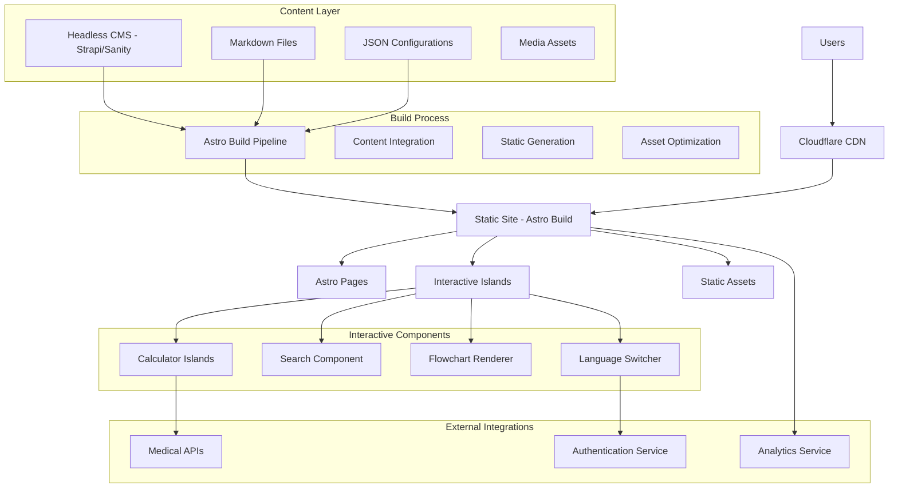

# Astro Clinical Platform - Design Document

## Overview

The Astro Clinical Platform is a high-performance, SEO-optimized medical platform built with Astro's static site generation capabilities. The platform combines clinical decision-making tools with patient education functionality, leveraging Astro's partial hydration for interactive components while maintaining excellent performance and search engine visibility.

## Architecture

### System Architecture



### Technology Stack

- **Framework**: Astro 4.x (Static Site Generator with Islands Architecture)
- **UI Framework**: React 18 or Vue 3 (for interactive islands only)
- **Styling**: Tailwind CSS with custom medical theme
- **Content Management**: Headless CMS (Strapi or Sanity)
- **Search**: Pagefind (Astro's recommended static search)
- **Flowcharts**: Mermaid.js with custom medical styling
- **Internationalization**: Astro i18n with content collections
- **Authentication**: Client-side JWT with HttpOnly Cookies (recommended for enhanced XSS protection) or secure localStorage as fallback
- **Analytics**: Privacy-focused analytics (Plausible or similar)
- **Deployment**: Vercel/Netlify with automatic builds
- **CDN**: Cloudflare for global performance

## Components and Interfaces

### Astro Project Structure

```
src/
├── components/
│   ├── ui/                    # Reusable UI components
│   ├── islands/               # Interactive Astro islands
│   │   ├── Calculator.tsx     # Medical calculator component
│   │   ├── Search.tsx         # Global search functionality
│   │   ├── FlowchartRenderer.tsx # Mermaid flowchart renderer
│   │   └── LanguageSwitcher.tsx # Language selection
│   ├── layout/                # Layout components
│   └── medical/               # Medical-specific components
├── content/
│   ├── config.ts             # Content collections config
│   ├── calculators/          # Calculator configurations
│   ├── education/            # Educational content
│   └── flowcharts/           # Flowchart definitions
├── layouts/
│   ├── BaseLayout.astro      # Main layout
│   ├── ToolLayout.astro      # Calculator tool layout
│   └── EducationLayout.astro # Education content layout
├── pages/
│   ├── index.astro           # Homepage
│   ├── tools/                # Calculator pages
│   ├── education/            # Educational content pages
│   └── [lang]/               # Internationalized routes
├── styles/
│   ├── global.css           # Global styles
│   └── medical-theme.css    # Medical-specific styling
└── utils/
    ├── calculations.ts      # Medical calculation logic
    ├── i18n.ts             # Internationalization utilities
    └── api.ts              # External API integrations
```

### Core Component Architecture

The platform leverages Astro's Islands Architecture where interactive components are hydrated only when needed. Key interactive islands include:

- **Calculator Islands**: Dynamic medical calculators with real-time computation
- **Search Component**: Static search using Pagefind with instant results
- **Flowchart Renderer**: Mermaid.js integration for diagnostic flowcharts
- **Language Switcher**: Multi-language support with user preference persistence

Each island is designed to be self-contained, performant, and accessible, following medical software standards.

### Content Collections Configuration

```typescript
// src/content/config.ts
import { defineCollection, z } from 'astro:content';

const calculators = defineCollection({
  type: 'data',
  schema: z.object({
    id: z.string(),
    name: z.record(z.string()), // Multi-language support
    category: z.string(),
    description: z.record(z.string()),
    fields: z.array(z.object({
      id: z.string(),
      type: z.enum(['select', 'number', 'checkbox', 'radio']),
      label: z.record(z.string()),
      options: z.array(z.object({
        value: z.union([z.string(), z.number()]),
        label: z.record(z.string())
      })).optional(),
      validation: z.object({
        required: z.boolean().optional(),
        min: z.number().optional(),
        max: z.number().optional()
      }).optional()
    })),
    calculation: z.string(), // Function name reference (e.g., "calculateCHADSVASC") - safer than executable formulas
    interpretation: z.array(z.object({
      range: z.tuple([z.number(), z.number()]),
      risk: z.enum(['low', 'moderate', 'high']),
      recommendation: z.record(z.string()),
      color: z.string().optional()
    })),
    references: z.array(z.object({
      title: z.string(),
      url: z.string(),
      year: z.number().optional()
    })).optional()
  })
});

const education = defineCollection({
  type: 'content',
  schema: z.object({
    title: z.record(z.string()),
    category: z.string(),
    tags: z.array(z.string()),
    lastUpdated: z.date(),
    author: z.string().optional(),
    reviewedBy: z.string().optional(),
    difficulty: z.enum(['basic', 'intermediate', 'advanced']).optional(),
    estimatedReadTime: z.number().optional(),
    relatedTools: z.array(z.string()).optional(),
    flowchartCode: z.string().optional(), // Inline Mermaid syntax for simple flowcharts
    media: z.array(z.object({
      type: z.enum(['image', 'video', 'audio']),
      src: z.string(),
      alt: z.record(z.string()).optional(),
      caption: z.record(z.string()).optional()
    })).optional()
  })
});

const flowcharts = defineCollection({
  type: 'data',
  schema: z.object({
    id: z.string(),
    title: z.record(z.string()),
    category: z.string(),
    mermaidCode: z.string(),
    description: z.record(z.string()).optional(),
    accessibility: z.object({
      textAlternative: z.record(z.string()),
      ariaLabel: z.record(z.string())
    })
  })
});

export const collections = {
  calculators,
  education,
  flowcharts
};
```

### Content Type Usage Strategy

The platform supports two approaches for flowchart integration:

1. **Inline Flowcharts**: Simple flowcharts can be embedded directly in educational content using the `flowchartCode` field with Mermaid syntax
2. **Reusable Flowcharts**: Complex flowcharts are defined in the `flowcharts` collection and can be referenced across multiple educational articles

**Note**: All content data models are automatically generated by Astro's Content Collections based on the Zod schemas above. This ensures type safety and maintains a single source of truth for all content structures.

## Interactive Components Design

### Flowchart Renderer Component

```typescript
// FlowchartRenderer Island
interface FlowchartRendererProps {
  mermaidCode: string;
  title: Record<string, string>;
  accessibility: AccessibilityConfig;
  locale: string;
  theme?: 'medical' | 'default';
}

export default function FlowchartRenderer({ 
  mermaidCode, 
  title, 
  accessibility, 
  locale, 
  theme = 'medical' 
}: FlowchartRendererProps) {
  const [isLoaded, setIsLoaded] = useState(false);
  const [error, setError] = useState<string | null>(null);
  const chartRef = useRef<HTMLDivElement>(null);

  useEffect(() => {
    const renderChart = async () => {
      try {
        const mermaid = await import('mermaid');
        
        // Configure Mermaid with medical theme
        mermaid.default.initialize({
          theme: theme === 'medical' ? 'base' : 'default',
          themeVariables: theme === 'medical' ? {
            primaryColor: '#3B82F6',
            primaryTextColor: '#1F2937',
            primaryBorderColor: '#E5E7EB',
            lineColor: '#6B7280',
            secondaryColor: '#F3F4F6',
            tertiaryColor: '#FFFFFF'
          } : undefined,
          flowchart: {
            useMaxWidth: true,
            htmlLabels: true
          },
          accessibility: {
            enabled: true
          }
        });

        if (chartRef.current) {
          const { svg } = await mermaid.default.render(
            `flowchart-${Date.now()}`, 
            mermaidCode
          );
          
          chartRef.current.innerHTML = svg;
          
          // Add accessibility attributes
          const svgElement = chartRef.current.querySelector('svg');
          if (svgElement) {
            svgElement.setAttribute('role', 'img');
            svgElement.setAttribute('aria-label', accessibility.ariaLabel[locale]);
            svgElement.setAttribute('tabindex', '0');
          }
          
          setIsLoaded(true);
        }
      } catch (err) {
        setError(err instanceof Error ? err.message : 'Failed to render flowchart');
      }
    };

    renderChart();
  }, [mermaidCode, theme, locale]);

  if (error) {
    return (
      <div className="flowchart-error" role="alert">
        <p>Unable to display flowchart</p>
        <details>
          <summary>Text alternative</summary>
          <p>{accessibility.textAlternative[locale]}</p>
        </details>
      </div>
    );
  }

  return (
    <div className="flowchart-container">
      <div 
        ref={chartRef} 
        className={`flowchart-content ${!isLoaded ? 'loading' : ''}`}
        style={{ minHeight: isLoaded ? 'auto' : '200px' }}
      />
      
      {/* Screen reader alternative */}
      <div className="sr-only">
        <h3>{title[locale]}</h3>
        <p>{accessibility.textAlternative[locale]}</p>
      </div>
      
      {/* Loading state */}
      {!isLoaded && !error && (
        <div className="flowchart-loading" aria-hidden="true">
          <div className="animate-pulse bg-gray-200 h-48 rounded"></div>
        </div>
      )}
    </div>
  );
}
```

## Error Handling

### Comprehensive Error Handling Strategy

#### Client-Side Error Boundaries

```typescript
// Error boundary for interactive islands
class MedicalToolErrorBoundary extends Component<
  { children: ReactNode; fallback?: ReactNode },
  { hasError: boolean; error?: Error }
> {
  constructor(props: any) {
    super(props);
    this.state = { hasError: false };
  }

  static getDerivedStateFromError(error: Error) {
    return { hasError: true, error };
  }

  componentDidCatch(error: Error, errorInfo: ErrorInfo) {
    // Log error for monitoring
    console.error('Medical tool error:', error, errorInfo);
    
    // Report to analytics if available
    if (typeof window !== 'undefined' && window.plausible) {
      window.plausible('Error', {
        props: {
          component: 'MedicalTool',
          error: error.message
        }
      });
    }
  }

  render() {
    if (this.state.hasError) {
      return this.props.fallback || (
        <div className="error-fallback" role="alert">
          <h3>Tool temporarily unavailable</h3>
          <p>Please refresh the page or try again later.</p>
          <button 
            onClick={() => this.setState({ hasError: false })}
            className="btn-primary"
          >
            Try Again
          </button>
        </div>
      );
    }

    return this.props.children;
  }
}
```

#### Calculation Error Handling

```typescript
// Safe calculation wrapper with function-based approach
const calculationFunctions = {
  calculateCHADSVASC: (inputs: Record<string, any>) => {
    // Secure, predefined calculation logic
    return inputs.age + inputs.gender + inputs.chf + inputs.hypertension + 
           inputs.stroke + inputs.vascular + inputs.diabetes;
  },
  // Add other calculation functions here
};

export function safeCalculate(
  inputs: Record<string, any>,
  config: CalculatorConfig
): CalculationResult | CalculationError {
  try {
    // Validate inputs
    const validationResult = validateInputs(inputs, config);
    if (!validationResult.isValid) {
      return {
        type: 'validation_error',
        message: validationResult.errors,
        suggestions: generateInputSuggestions(config)
      };
    }

    // Use predefined function instead of eval() for security
    const calculationFunction = calculationFunctions[config.calculation];
    if (!calculationFunction) {
      throw new Error(`Unknown calculation function: ${config.calculation}`);
    }

    const result = calculationFunction(inputs);
    
    // Validate result
    if (!isValidResult(result)) {
      return {
        type: 'calculation_error',
        message: 'Invalid calculation result',
        fallback: getDefaultResult(config)
      };
    }

    return result;
  } catch (error) {
    return {
      type: 'system_error',
      message: 'Calculation failed',
      error: error instanceof Error ? error.message : 'Unknown error',
      timestamp: new Date().toISOString()
    };
  }
}
```

## Testing Strategy

### Astro-Specific Testing Approach

#### Component Testing

```typescript
// Test calculator island functionality
import { render, screen, fireEvent, waitFor } from '@testing-library/react';
import Calculator from '../components/islands/Calculator';
import { mockCalculatorConfig } from '../__mocks__/calculatorConfig';

describe('Calculator Island', () => {
  test('should calculate CHA2DS2-VASc score correctly', async () => {
    render(
      <Calculator 
        calculatorId="cha2ds2-vasc"
        config={mockCalculatorConfig}
        locale="en"
      />
    );

    // Input high-risk patient data
    fireEvent.change(screen.getByLabelText(/age/i), { target: { value: '2' } });
    fireEvent.change(screen.getByLabelText(/heart failure/i), { target: { value: '1' } });
    fireEvent.change(screen.getByLabelText(/hypertension/i), { target: { value: '1' } });

    await waitFor(() => {
      expect(screen.getByText(/score: 4/i)).toBeInTheDocument();
      expect(screen.getByText(/high risk/i)).toBeInTheDocument();
      expect(screen.getByText(/anticoagulation recommended/i)).toBeInTheDocument();
    });
  });

  test('should handle invalid inputs gracefully', async () => {
    render(
      <Calculator 
        calculatorId="cha2ds2-vasc"
        config={mockCalculatorConfig}
        locale="en"
      />
    );

    // Test with invalid input
    fireEvent.change(screen.getByLabelText(/age/i), { target: { value: 'invalid' } });

    await waitFor(() => {
      expect(screen.getByText(/please enter a valid value/i)).toBeInTheDocument();
    });
  });
});
```

#### Integration Testing with Astro

```typescript
// Test Astro page rendering
import { experimental_AstroContainer as AstroContainer } from 'astro/container';
import { expect, test } from 'vitest';
import CalculatorPage from '../pages/tools/[calculator].astro';

test('Calculator page renders correctly', async () => {
  const container = await AstroContainer.create();
  const result = await container.renderToString(CalculatorPage, {
    params: { calculator: 'cha2ds2-vasc' },
    props: {
      calculator: mockCalculatorConfig,
      locale: 'en'
    }
  });

  expect(result).toContain('CHA₂DS₂-VASc Score');
  expect(result).toContain('calculator-container');
});
```

#### Performance Testing

```typescript
// Test Core Web Vitals
import { getCLS, getFID, getFCP, getLCP, getTTFB } from 'web-vitals';

function measureWebVitals() {
  getCLS(console.log);
  getFID(console.log);
  getFCP(console.log);
  getLCP(console.log);
  getTTFB(console.log);
}

// Automated performance testing
describe('Performance Tests', () => {
  test('should meet Core Web Vitals thresholds', async () => {
    const metrics = await measurePagePerformance('/tools/cha2ds2-vasc');
    
    expect(metrics.LCP).toBeLessThan(2500); // Good LCP
    expect(metrics.FID).toBeLessThan(100);  // Good FID
    expect(metrics.CLS).toBeLessThan(0.1);  // Good CLS
  });
});
```

### Accessibility Testing

```typescript
// Automated accessibility testing
import { axe, toHaveNoViolations } from 'jest-axe';

expect.extend(toHaveNoViolations);

test('Calculator should be accessible', async () => {
  const { container } = render(
    <Calculator 
      calculatorId="cha2ds2-vasc"
      config={mockCalculatorConfig}
      locale="en"
    />
  );

  const results = await axe(container);
  expect(results).toHaveNoViolations();
});

test('Flowchart should have proper ARIA labels', async () => {
  const { container } = render(
    <FlowchartRenderer 
      mermaidCode="graph TD; A-->B"
      title={{ en: "Test Flowchart" }}
      accessibility={{
        textAlternative: { en: "A flowchart showing A leading to B" },
        ariaLabel: { en: "Test diagnostic flowchart" }
      }}
      locale="en"
    />
  );

  await waitFor(() => {
    const svg = container.querySelector('svg');
    expect(svg).toHaveAttribute('role', 'img');
    expect(svg).toHaveAttribute('aria-label', 'Test diagnostic flowchart');
  });
});
```

This design document provides a comprehensive technical architecture for the Astro Clinical Platform, leveraging Astro's strengths in static site generation, performance optimization, and SEO while providing the interactive functionality needed for medical tools through the islands architecture.