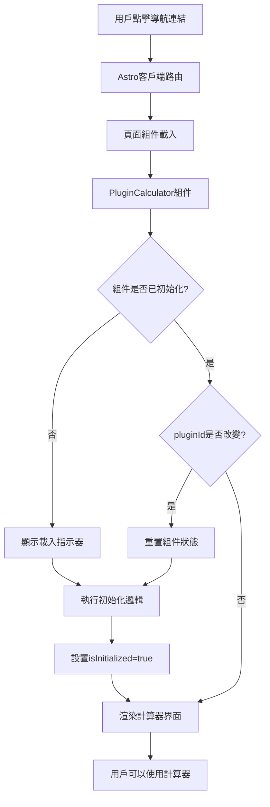

# CHA₂DS₂-VASc計算器導航水合問題修復設計文檔

## 概述

本設計文檔描述了解決CHA₂DS₂-VASc計算器通過客戶端導航進入時出現轉圈圈無法載入組件問題的技術方案。問題的根本原因是Astro的客戶端路由與React組件水合機制之間的不匹配，導致組件在客戶端導航時無法正確初始化。

## 架構

### 問題分析

根據Astro文檔和Context7提供的資訊，問題的核心在於：

1. **Astro Islands水合機制**: 使用`client:load`指令的組件會在頁面載入時進行水合
2. **客戶端導航問題**: 通過客戶端導航進入頁面時，React組件可能沒有正確重新初始化
3. **組件狀態保留**: 組件狀態可能保留了之前的值，導致載入狀態持續

### 解決方案架構



## 組件和介面

### 1. PluginCalculator組件增強

#### 狀態管理改進

```typescript
interface PluginCalculatorState {
  isInitialized: boolean;
  isLoading: boolean;
  inputs: Record<string, any>;
  result: any;
  errors: Record<string, string>;
}

// 新增初始化狀態
const [isInitialized, setIsInitialized] = useState(false);

// 初始化邏輯
useEffect(() => {
  setIsInitialized(true);
  // 重置狀態當 pluginId 改變時
  setInputs({});
  setResult(null);
  setErrors({});
  setIsLoading(false);
}, [pluginId]);
```

#### 載入狀態處理

```typescript
// 顯示載入狀態直到組件完全初始化
if (!isInitialized) {
  return (
    <div className="bg-white rounded-lg border border-gray-200 p-6">
      <div className="flex items-center justify-center py-8">
        <div className="animate-spin rounded-full h-8 w-8 border-b-2 border-blue-600"></div>
        <span className="ml-3 text-gray-600">載入中...</span>
      </div>
    </div>
  );
}
```

### 2. 頁面組件修復

#### Key屬性強制重新掛載

```astro
<!-- 在 cha2ds2-vasc.astro 中 -->
<PluginCalculator 
  key="cardiology.cha2ds2-vasc"  <!-- 強制組件唯一性 -->
  client:load
  pluginId="cardiology.cha2ds2-vasc"
  locale={locale}
  theme="light"
  accessibility={{
    highContrast: false,
    largeText: false,
    screenReader: false
  }}
  className="cha2ds2-vasc-calculator"
/>
```

#### 動態路由處理

```astro
<!-- 在 [calculator].astro 中 -->
<PluginCalculator 
  key={pluginId}  <!-- 當pluginId改變時強制重新掛載 -->
  pluginId={pluginId}
  locale={locale}
  theme="light"
  client:load
/>
```

### 3. 錯誤處理機制

#### 多層錯誤處理

```typescript
const handleCalculate = () => {
  try {
    setIsLoading(true);
    setErrors({}); // 清除之前的錯誤
    
    // 添加小延遲以顯示載入狀態
    setTimeout(() => {
      try {
        const calculationResult = calculator.calculate(inputs);
        setResult(calculationResult);
      } catch (calcError) {
        console.error('Calculation error:', calcError);
        onError?.(calcError as Error);
        setErrors({ general: '計算時發生錯誤，請檢查輸入值' });
      } finally {
        setIsLoading(false);
      }
    }, 100);
  } catch (error) {
    console.error('Calculation setup error:', error);
    onError?.(error as Error);
    setErrors({ general: '計算器初始化錯誤' });
    setIsLoading(false);
  }
};
```

## 資料模型

### 組件狀態模型

```typescript
interface ComponentState {
  // 初始化狀態
  isInitialized: boolean;
  
  // 載入狀態
  isLoading: boolean;
  
  // 輸入資料
  inputs: Record<string, any>;
  
  // 計算結果
  result: CalculationResult | null;
  
  // 錯誤狀態
  errors: Record<string, string>;
}
```

### 錯誤類型定義

```typescript
interface ErrorState {
  general?: string;        // 一般錯誤
  initialization?: string; // 初始化錯誤
  calculation?: string;    // 計算錯誤
  network?: string;        // 網路錯誤
  timeout?: string;        // 超時錯誤
}
```

## 錯誤處理

### 錯誤分類和處理策略

1. **初始化錯誤**
   - 組件無法正確初始化
   - 顯示重新載入按鈕
   - 記錄詳細錯誤資訊

2. **計算錯誤**
   - 輸入驗證失敗
   - 計算邏輯錯誤
   - 顯示具體錯誤訊息

3. **網路錯誤**
   - 資源載入失敗
   - 提供重試機制
   - 顯示離線提示

4. **超時錯誤**
   - 組件載入超時
   - 自動重試機制
   - 用戶手動重試選項

### 錯誤恢復機制

```typescript
const ErrorBoundary = ({ children, onError, fallback }) => {
  return (
    <React.ErrorBoundary
      onError={(error, errorInfo) => {
        console.error('Component error:', error, errorInfo);
        onError?.(error);
      }}
      fallback={({ error }) => (
        <div className="error-boundary">
          <h3>組件載入失敗</h3>
          <p>{error.message}</p>
          <button onClick={() => window.location.reload()}>
            重新載入
          </button>
        </div>
      )}
    >
      {children}
    </React.ErrorBoundary>
  );
};
```

## 測試策略

### 單元測試

1. **組件初始化測試**
   - 測試組件正確初始化
   - 測試狀態重置邏輯
   - 測試錯誤處理

2. **狀態管理測試**
   - 測試輸入變更處理
   - 測試計算邏輯
   - 測試錯誤狀態管理

### 整合測試

1. **導航測試**
   - 測試客戶端導航
   - 測試頁面刷新
   - 測試瀏覽器前進後退

2. **跨瀏覽器測試**
   - Chrome、Firefox、Safari、Edge
   - 移動設備測試
   - 不同螢幕尺寸測試

### 端到端測試

1. **用戶流程測試**
   - 從tools頁面導航到計算器
   - 在不同計算器間切換
   - 完整的計算流程

2. **錯誤場景測試**
   - 網路中斷情況
   - 組件載入失敗
   - 計算錯誤處理

## 性能考量

### 載入性能優化

1. **延遲載入**
   - 使用`client:visible`對於非首屏組件
   - 實現組件預載入機制

2. **快取策略**
   - 組件實例快取
   - 計算結果快取
   - 靜態資源快取

### 記憶體管理

1. **組件清理**
   - 正確清理事件監聽器
   - 取消未完成的請求
   - 清理定時器和間隔器

2. **狀態管理**
   - 避免記憶體洩漏
   - 正確處理組件卸載
   - 清理全域狀態

## 可訪問性設計

### ARIA支援

```typescript
// 載入狀態的ARIA標籤
<div 
  role="status" 
  aria-live="polite" 
  aria-label="計算器載入中"
>
  <div className="animate-spin..."></div>
  <span className="sr-only">載入中...</span>
</div>

// 錯誤訊息的ARIA標籤
<div 
  role="alert" 
  aria-live="assertive"
  className="error-message"
>
  {errorMessage}
</div>
```

### 鍵盤導航

1. **Tab順序管理**
   - 正確的Tab索引
   - 跳過隱藏元素
   - 焦點管理

2. **快捷鍵支援**
   - Enter鍵提交
   - Escape鍵取消
   - 方向鍵導航

## 監控和日誌

### 錯誤監控

```typescript
const logError = (error: Error, context: string) => {
  console.error(`[${context}] Error:`, {
    message: error.message,
    stack: error.stack,
    timestamp: new Date().toISOString(),
    userAgent: navigator.userAgent,
    url: window.location.href
  });
  
  // 發送到錯誤監控服務
  if (typeof window !== 'undefined' && window.errorReporting) {
    window.errorReporting.captureException(error, { context });
  }
};
```

### 性能監控

```typescript
const measurePerformance = (operation: string, startTime: number) => {
  const endTime = performance.now();
  const duration = endTime - startTime;
  
  console.log(`[Performance] ${operation}: ${duration.toFixed(2)}ms`);
  
  // 記錄性能指標
  if (duration > 2000) {
    console.warn(`[Performance] Slow operation detected: ${operation}`);
  }
};
```

## 部署考量

### 環境配置

1. **開發環境**
   - 詳細的錯誤訊息
   - 性能監控啟用
   - 調試資訊顯示

2. **生產環境**
   - 簡化的錯誤訊息
   - 錯誤報告服務
   - 性能優化啟用

### 漸進式部署

1. **功能開關**
   - 新功能的開關控制
   - A/B測試支援
   - 回滾機制

2. **監控指標**
   - 錯誤率監控
   - 載入時間監控
   - 用戶體驗指標

這個設計確保了CHA₂DS₂-VASc計算器和其他計算器在客戶端導航時能夠正確載入和初始化，解決了轉圈圈無法載入的問題，同時提供了健壯的錯誤處理和良好的用戶體驗。