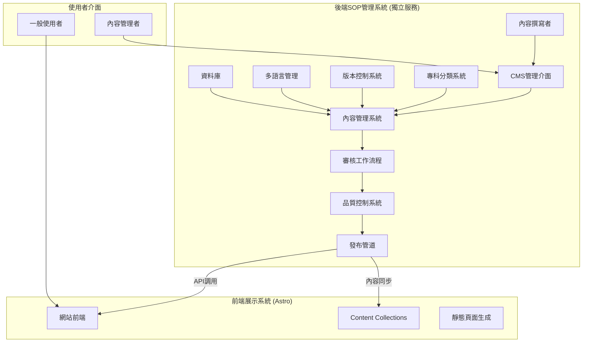
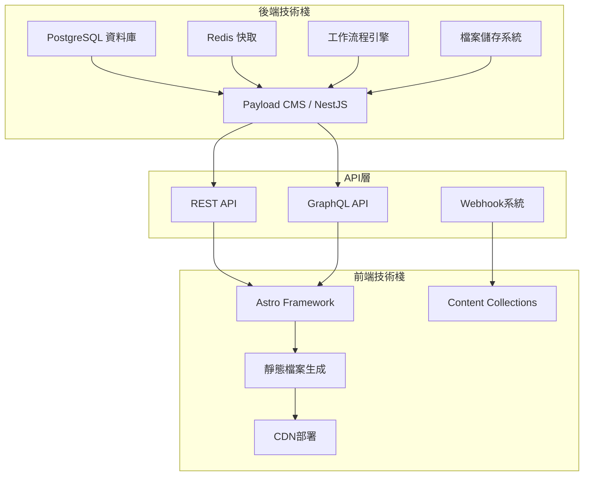
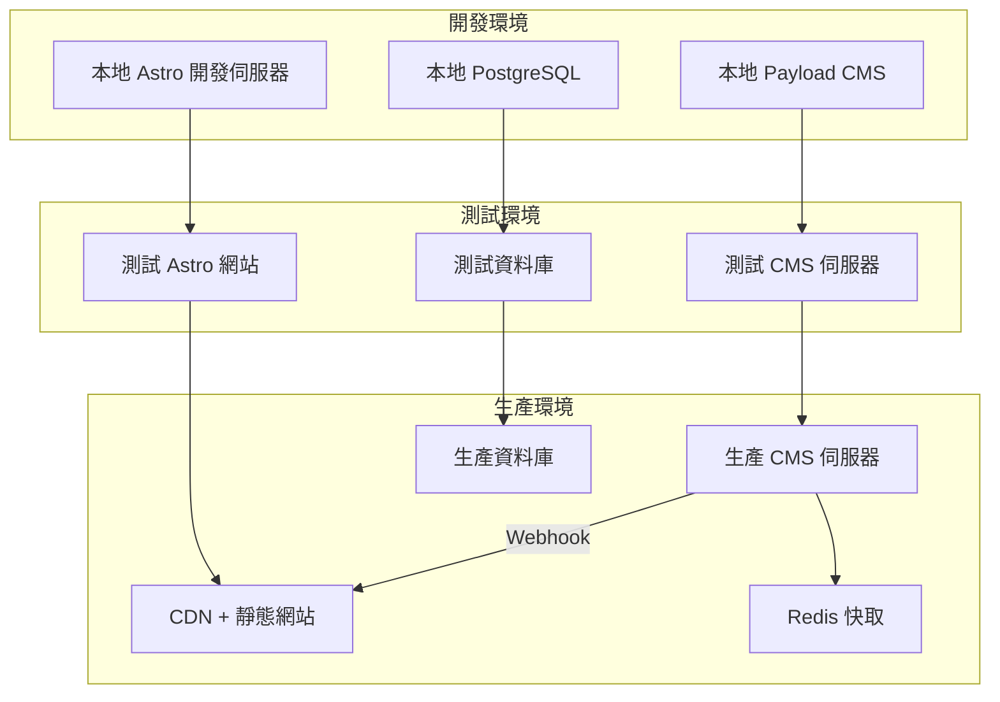
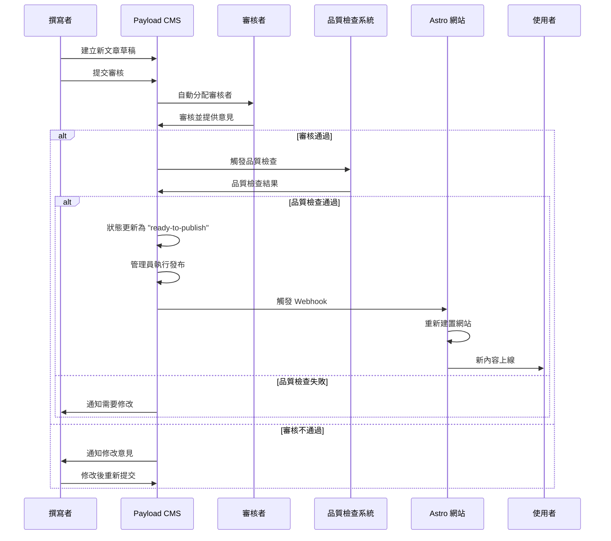
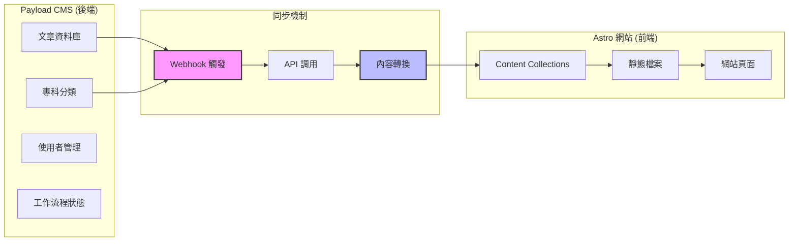
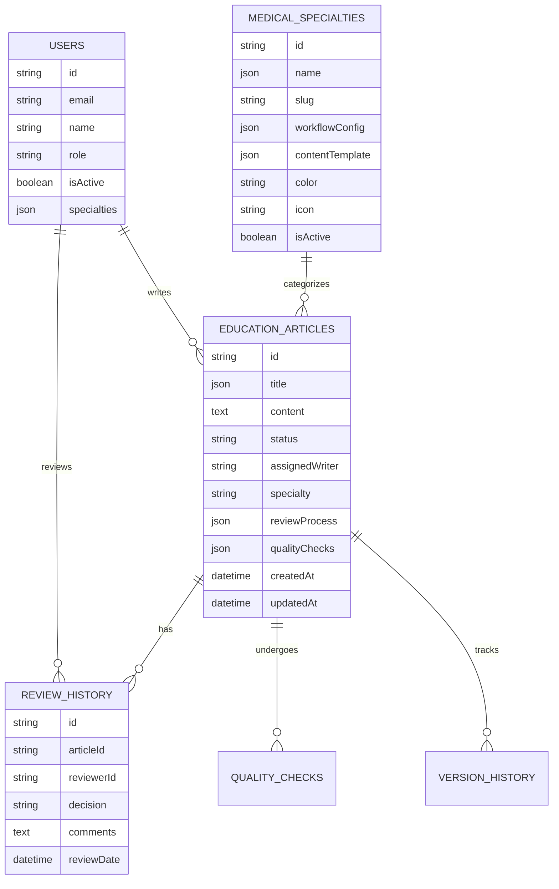
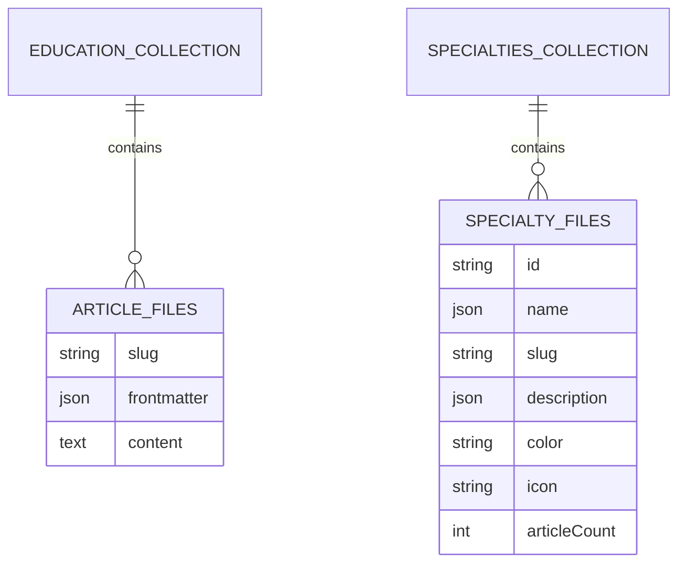
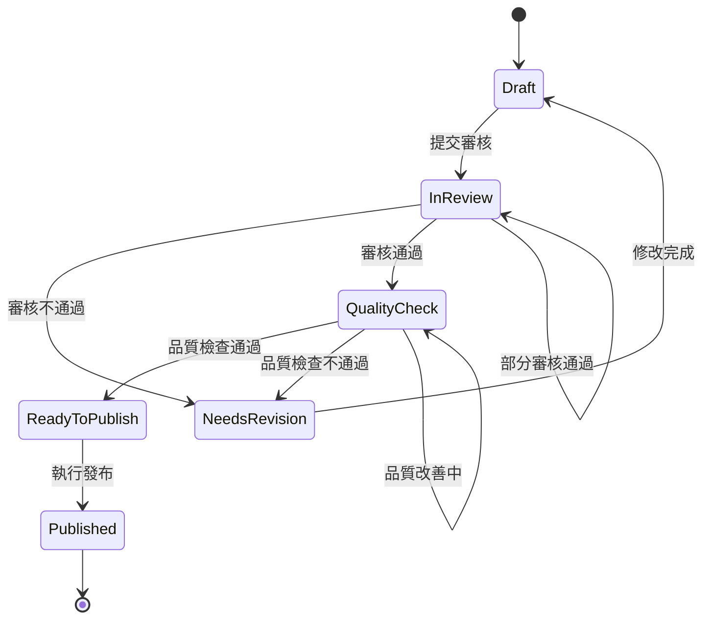

# 設計文件

## 概述

本設計文件詳細說明衛教文章發布SOP系統的架構設計，該系統採用前後端分離架構：

1. **後端SOP管理系統**：獨立的內容管理和工作流程系統，負責文章撰寫、審核、品質控制等完整的SOP流程
2. **前端展示系統**：基於Astro的高效能靜態網站，負責展示已發布的衛教內容

這種架構確保了職責分離，讓複雜的業務邏輯在後端處理，而前端專注於內容展示和使用者體驗。

## 架構

### 系統架構概覽



### 技術架構



## 組件和介面

### 1. 後端SOP管理系統

#### 1.1 技術選擇：Payload CMS

基於需求分析，我們選擇 **Payload CMS** 作為後端SOP管理系統的基礎框架，原因如下：

- **TypeScript原生支援**：與現有程式碼風格一致
- **高度可客製化**：支援複雜的工作流程和業務邏輯
- **內建使用者管理**：支援角色權限控制
- **API優先設計**：提供REST和GraphQL API
- **資料庫彈性**：支援PostgreSQL、MongoDB等

#### 1.2 醫學專科分類系統（後端）

```typescript
// payload.config.ts - Payload CMS 配置
import { CollectionConfig } from 'payload/types';

export const MedicalSpecialties: CollectionConfig = {
  slug: 'medical-specialties',
  admin: {
    useAsTitle: 'name',
    defaultColumns: ['name', 'slug', 'isActive', 'articleCount'],
  },
  access: {
    read: () => true,
    create: ({ req: { user } }) => user?.role === 'admin',
    update: ({ req: { user } }) => user?.role === 'admin',
    delete: ({ req: { user } }) => user?.role === 'admin',
  },
  fields: [
    {
      name: 'name',
      type: 'group',
      fields: [
        { name: 'zh_TW', type: 'text', required: true },
        { name: 'en', type: 'text', required: true },
        { name: 'ja', type: 'text' },
      ],
    },
    {
      name: 'slug',
      type: 'text',
      required: true,
      unique: true,
    },
    {
      name: 'workflowConfig',
      type: 'group',
      fields: [
        {
          name: 'reviewerRoles',
          type: 'select',
          hasMany: true,
          options: [
            { label: '專科醫師', value: 'specialist' },
            { label: '醫學編輯', value: 'medical-editor' },
            { label: '內容審核員', value: 'content-reviewer' },
          ],
        },
        {
          name: 'requiredApprovals',
          type: 'number',
          defaultValue: 2,
          min: 1,
          max: 5,
        },
        {
          name: 'reviewTimeLimit',
          type: 'number',
          defaultValue: 7,
          admin: { description: '審核時限（天數）' },
        },
      ],
    },
    {
      name: 'contentTemplate',
      type: 'group',
      fields: [
        {
          name: 'requiredSections',
          type: 'array',
          fields: [
            { name: 'section', type: 'text' },
          ],
        },
        {
          name: 'customFields',
          type: 'array',
          fields: [
            { name: 'name', type: 'text' },
            {
              name: 'type',
              type: 'select',
              options: ['text', 'number', 'select', 'multiselect'],
            },
            { name: 'required', type: 'checkbox' },
          ],
        },
      ],
    },
    {
      name: 'isActive',
      type: 'checkbox',
      defaultValue: true,
    },
  ],
};
```

#### 1.2 專科分類資料結構

```json
{
  "cardiology": {
    "id": "cardiology",
    "name": {
      "zh-TW": "心臟科",
      "en": "Cardiology",
      "ja": "循環器科"
    },
    "slug": "cardiology",
    "workflowConfig": {
      "reviewerRoles": ["cardiologist", "medical-editor"],
      "requiredApprovals": 2,
      "reviewTimeLimit": 7,
      "specialRequirements": ["evidence-level-check", "guideline-compliance"]
    },
    "contentTemplate": {
      "requiredSections": ["症狀識別", "診斷方法", "治療策略", "預防措施"],
      "optionalSections": ["併發症", "預後", "最新研究"],
      "customFields": [
        {
          "name": "心律分類",
          "type": "select",
          "required": true,
          "options": ["正常", "心律不整", "心房顫動", "心室顫動"]
        }
      ]
    },
    "color": "#e74c3c",
    "icon": "heart",
    "articleCount": 15,
    "isActive": true,
    "sortOrder": 1
  }
}
```

#### 1.3 衛教文章管理系統（後端）

```typescript
// collections/EducationArticles.ts - Payload CMS 配置
export const EducationArticles: CollectionConfig = {
  slug: 'education-articles',
  admin: {
    useAsTitle: 'title',
    defaultColumns: ['title', 'specialty', 'status', 'assignedWriter', 'updatedAt'],
  },
  versions: {
    drafts: true,
    maxPerDoc: 10,
  },
  access: {
    read: ({ req: { user } }) => {
      if (user?.role === 'admin') return true;
      if (user?.role === 'editor') return true;
      // 只能看到已發布的文章
      return { status: { equals: 'published' } };
    },
    create: ({ req: { user } }) => ['admin', 'editor', 'writer'].includes(user?.role),
    update: ({ req: { user }, id }) => {
      if (user?.role === 'admin') return true;
      // 作者只能編輯自己的文章
      return { assignedWriter: { equals: user?.id } };
    },
  },
  fields: [
    {
      name: 'title',
      type: 'group',
      fields: [
        { name: 'zh_TW', type: 'text', required: true },
        { name: 'en', type: 'text', required: true },
        { name: 'ja', type: 'text' },
      ],
    },
    {
      name: 'content',
      type: 'richText',
      required: true,
    },
    {
      name: 'specialty',
      type: 'relationship',
      relationTo: 'medical-specialties',
      required: true,
    },
    {
      name: 'status',
      type: 'select',
      options: [
        { label: '草稿', value: 'draft' },
        { label: '審核中', value: 'in-review' },
        { label: '需要修改', value: 'needs-revision' },
        { label: '品質檢查', value: 'quality-check' },
        { label: '準備發布', value: 'ready-to-publish' },
        { label: '已發布', value: 'published' },
      ],
      defaultValue: 'draft',
      admin: {
        position: 'sidebar',
      },
    },
    {
      name: 'assignedWriter',
      type: 'relationship',
      relationTo: 'users',
      admin: {
        position: 'sidebar',
      },
    },
    {
      name: 'reviewProcess',
      type: 'group',
      admin: {
        condition: (data) => ['in-review', 'needs-revision'].includes(data.status),
      },
      fields: [
        {
          name: 'currentReviewers',
          type: 'relationship',
          relationTo: 'users',
          hasMany: true,
        },
        {
          name: 'reviewHistory',
          type: 'array',
          fields: [
            {
              name: 'reviewer',
              type: 'relationship',
              relationTo: 'users',
            },
            {
              name: 'decision',
              type: 'select',
              options: ['approved', 'rejected', 'needs-revision'],
            },
            {
              name: 'comments',
              type: 'textarea',
            },
            {
              name: 'reviewDate',
              type: 'date',
              defaultValue: () => new Date(),
            },
          ],
        },
      ],
    },
    {
      name: 'qualityChecks',
      type: 'group',
      admin: {
        condition: (data) => data.status === 'quality-check',
      },
      fields: [
        { name: 'structureCheck', type: 'checkbox' },
        { name: 'contentCheck', type: 'checkbox' },
        { name: 'medicalAccuracyCheck', type: 'checkbox' },
        { name: 'seoCheck', type: 'checkbox' },
        { name: 'accessibilityCheck', type: 'checkbox' },
      ],
    },
  ],
  hooks: {
    beforeChange: [
      // 自動分配審核者
      async ({ data, operation }) => {
        if (operation === 'update' && data.status === 'in-review') {
          // 根據專科自動分配審核者的邏輯
        }
      },
    ],
    afterChange: [
      // 狀態變更後的通知邏輯
      async ({ doc, operation }) => {
        if (operation === 'update') {
          // 發送通知給相關人員
        }
      },
    ],
  },
};
```

#### 1.4 工作流程引擎（後端）

```typescript
// services/WorkflowService.ts - 自定義工作流程服務
import { Payload } from 'payload';

export class WorkflowService {
  constructor(private payload: Payload) {}

  async transitionStatus(
    articleId: string, 
    fromStatus: string, 
    toStatus: string, 
    userId: string,
    comments?: string
  ): Promise<void> {
    // 驗證狀態轉換是否合法
    if (!this.isValidTransition(fromStatus, toStatus)) {
      throw new Error(`Invalid transition from ${fromStatus} to ${toStatus}`);
    }

    // 更新文章狀態
    await this.payload.update({
      collection: 'education-articles',
      id: articleId,
      data: {
        status: toStatus,
        ...(toStatus === 'in-review' && {
          reviewProcess: {
            currentReviewers: await this.assignReviewers(articleId),
          },
        }),
      },
    });

    // 記錄狀態變更歷史
    await this.logStatusChange(articleId, fromStatus, toStatus, userId, comments);

    // 發送通知
    await this.sendNotifications(articleId, toStatus);
  }

  private isValidTransition(from: string, to: string): boolean {
    const validTransitions = {
      'draft': ['in-review'],
      'in-review': ['needs-revision', 'quality-check'],
      'needs-revision': ['draft', 'in-review'],
      'quality-check': ['ready-to-publish', 'needs-revision'],
      'ready-to-publish': ['published'],
    };

    return validTransitions[from]?.includes(to) || false;
  }

  private async assignReviewers(articleId: string): Promise<string[]> {
    // 根據文章專科自動分配審核者
    const article = await this.payload.findByID({
      collection: 'education-articles',
      id: articleId,
      depth: 2,
    });

    const specialty = article.specialty;
    const reviewerRoles = specialty.workflowConfig.reviewerRoles;

    // 查找符合角色的使用者
    const reviewers = await this.payload.find({
      collection: 'users',
      where: {
        role: { in: reviewerRoles },
        isActive: { equals: true },
      },
    });

    // 分配邏輯（例如：輪流分配、工作量平衡等）
    return this.distributeReviewers(reviewers.docs, specialty.workflowConfig.requiredApprovals);
  }
}
```

### 2. 前端展示系統（Astro）

#### 2.1 API整合層

```typescript
// src/services/CMSApiService.ts - Astro 前端的 API 服務
export class CMSApiService {
  private baseURL = process.env.CMS_API_URL || 'http://localhost:3000/api';
  
  async getPublishedArticles(specialty?: string): Promise<EducationArticle[]> {
    const params = new URLSearchParams({
      where: JSON.stringify({
        status: { equals: 'published' },
        ...(specialty && { 'specialty.slug': { equals: specialty } }),
      }),
      depth: '2',
    });
    
    const response = await fetch(`${this.baseURL}/education-articles?${params}`);
    const data = await response.json();
    return data.docs;
  }
  
  async getArticleBySlug(slug: string): Promise<EducationArticle | null> {
    const params = new URLSearchParams({
      where: JSON.stringify({
        slug: { equals: slug },
        status: { equals: 'published' },
      }),
      depth: '2',
    });
    
    const response = await fetch(`${this.baseURL}/education-articles?${params}`);
    const data = await response.json();
    return data.docs[0] || null;
  }
  
  async getMedicalSpecialties(): Promise<MedicalSpecialty[]> {
    const response = await fetch(`${this.baseURL}/medical-specialties?where[isActive][equals]=true`);
    const data = await response.json();
    return data.docs;
  }
}
```

#### 2.2 Astro Content Collections 整合

```typescript
// src/content/config.ts - 簡化的前端 Content Collections
import { defineCollection, z } from 'astro:content';

// 前端只需要展示用的簡化 schema
const education = defineCollection({
  type: 'content',
  schema: z.object({
    title: z.object({
      zh_TW: z.string(),
      en: z.string(),
      ja: z.string().optional(),
    }),
    excerpt: z.object({
      zh_TW: z.string(),
      en: z.string(),
      ja: z.string().optional(),
    }).optional(),
    category: z.string(),
    specialty: z.string(),
    tags: z.array(z.string()).default([]),
    difficulty: z.enum(['basic', 'intermediate', 'advanced']).default('basic'),
    readingTime: z.number().optional(),
    lastUpdated: z.string(),
    author: z.object({
      zh_TW: z.string(),
      en: z.string(),
      ja: z.string().optional(),
    }).optional(),
    featuredImage: z.object({
      src: z.string(),
      alt: z.object({
        zh_TW: z.string(),
        en: z.string(),
        ja: z.string().optional(),
      }),
    }).optional(),
    isActive: z.boolean().default(true),
    isFeatured: z.boolean().default(false),
  })
});

const medicalSpecialties = defineCollection({
  type: 'data',
  schema: z.object({
    id: z.string(),
    name: z.object({
      zh_TW: z.string(),
      en: z.string(),
      ja: z.string().optional(),
    }),
    slug: z.string(),
    description: z.object({
      zh_TW: z.string(),
      en: z.string(),
      ja: z.string().optional(),
    }).optional(),
    color: z.string().optional(),
    icon: z.string().optional(),
    articleCount: z.number().default(0),
    isActive: z.boolean().default(true),
  })
});

export const collections = {
  education,
  'medical-specialties': medicalSpecialties,
};
```

#### 2.3 內容同步機制

```typescript
// src/scripts/syncContent.ts - 從 CMS 同步內容到 Astro
import { CMSApiService } from '../services/CMSApiService';
import { writeFileSync, mkdirSync } from 'fs';
import { join } from 'path';

export async function syncContentFromCMS(): Promise<void> {
  const cmsApi = new CMSApiService();
  
  // 同步衛教文章
  const articles = await cmsApi.getPublishedArticles();
  
  for (const article of articles) {
    const frontmatter = {
      title: article.title,
      excerpt: article.excerpt,
      category: article.category,
      specialty: article.specialty.slug,
      tags: article.tags || [],
      difficulty: article.difficulty || 'basic',
      readingTime: article.readingTime,
      lastUpdated: article.updatedAt,
      author: article.author,
      featuredImage: article.featuredImage,
      isActive: true,
      isFeatured: article.isFeatured || false,
    };
    
    const content = `---
${JSON.stringify(frontmatter, null, 2)}
---

${article.content}`;
    
    const filePath = join(process.cwd(), 'src/content/education', `${article.slug}.md`);
    writeFileSync(filePath, content, 'utf-8');
  }
  
  // 同步醫學專科
  const specialties = await cmsApi.getMedicalSpecialties();
  
  for (const specialty of specialties) {
    const specialtyData = {
      id: specialty.id,
      name: specialty.name,
      slug: specialty.slug,
      description: specialty.description,
      color: specialty.color,
      icon: specialty.icon,
      articleCount: specialty.articleCount || 0,
      isActive: specialty.isActive,
    };
    
    const filePath = join(process.cwd(), 'src/content/medical-specialties', `${specialty.slug}.json`);
    writeFileSync(filePath, JSON.stringify(specialtyData, null, 2), 'utf-8');
  }
  
  console.log('Content sync completed successfully');
}

// 可以通過 webhook 或定時任務觸發
if (import.meta.url === `file://${process.argv[1]}`) {
  syncContentFromCMS().catch(console.error);
}
```

### 3. 系統整合和部署

#### 3.1 部署架構



#### 3.2 CI/CD 流程

```yaml
# .github/workflows/deploy.yml
name: Deploy SOP System

on:
  push:
    branches: [main]
  pull_request:
    branches: [main]

jobs:
  test-backend:
    runs-on: ubuntu-latest
    steps:
      - uses: actions/checkout@v3
      - name: Setup Node.js
        uses: actions/setup-node@v3
        with:
          node-version: '18'
      - name: Install dependencies
        run: npm install
        working-directory: ./backend
      - name: Run tests
        run: npm test
        working-directory: ./backend
      - name: Run linting
        run: npm run lint
        working-directory: ./backend

  test-frontend:
    runs-on: ubuntu-latest
    steps:
      - uses: actions/checkout@v3
      - name: Setup Node.js
        uses: actions/setup-node@v3
        with:
          node-version: '18'
      - name: Install dependencies
        run: npm install
        working-directory: ./frontend
      - name: Build Astro site
        run: npm run build
        working-directory: ./frontend
      - name: Run tests
        run: npm test
        working-directory: ./frontend

  deploy-backend:
    needs: [test-backend]
    runs-on: ubuntu-latest
    if: github.ref == 'refs/heads/main'
    steps:
      - name: Deploy to production
        run: |
          # 部署 Payload CMS 到雲端伺服器
          # 例如：部署到 Railway、Heroku 或 AWS

  deploy-frontend:
    needs: [test-frontend, deploy-backend]
    runs-on: ubuntu-latest
    if: github.ref == 'refs/heads/main'
    steps:
      - name: Sync content from CMS
        run: npm run sync-content
        working-directory: ./frontend
      - name: Build and deploy to CDN
        run: |
          npm run build
          # 部署到 Vercel、Netlify 或 AWS CloudFront
        working-directory: ./frontend
```

#### 3.3 Webhook 整合

```typescript
// backend/webhooks/contentSync.ts - Payload CMS Webhook
import { CollectionAfterChangeHook } from 'payload/types';

export const syncToAstroHook: CollectionAfterChangeHook = async ({
  doc,
  operation,
  req,
}) => {
  // 只有當文章狀態變為 'published' 時才觸發同步
  if (doc.status === 'published') {
    try {
      // 觸發 Astro 網站重新建置
      await fetch(process.env.ASTRO_BUILD_WEBHOOK_URL, {
        method: 'POST',
        headers: {
          'Content-Type': 'application/json',
          'Authorization': `Bearer ${process.env.WEBHOOK_SECRET}`,
        },
        body: JSON.stringify({
          type: 'content-updated',
          collection: 'education-articles',
          id: doc.id,
          operation,
        }),
      });
      
      console.log(`Triggered Astro rebuild for article: ${doc.id}`);
    } catch (error) {
      console.error('Failed to trigger Astro rebuild:', error);
    }
  }
};

// 在 EducationArticles collection 中註冊 hook
export const EducationArticles: CollectionConfig = {
  // ... 其他配置
  hooks: {
    afterChange: [syncToAstroHook],
  },
};
```

## 資料流程

### 1. 內容創建到發布流程



### 2. 系統間資料同步



## 資料模型

### 1. 後端資料結構 (Payload CMS)



### 2. 前端資料結構 (Astro Content Collections)



### 3. 工作流程狀態機



## 錯誤處理

### 1. 後端錯誤處理

```typescript
// backend/middleware/errorHandler.ts
export const errorHandler = (error: any, req: PayloadRequest, res: Response, next: NextFunction) => {
  const errorResponse = {
    message: error.message,
    status: error.status || 500,
    timestamp: new Date().toISOString(),
    path: req.url,
  };

  // 記錄錯誤
  console.error('API Error:', errorResponse);

  // 根據錯誤類型返回適當的回應
  switch (error.name) {
    case 'ValidationError':
      return res.status(400).json({
        ...errorResponse,
        type: 'validation_error',
        details: error.details,
      });
    
    case 'WorkflowError':
      return res.status(422).json({
        ...errorResponse,
        type: 'workflow_error',
        suggestedAction: '請檢查工作流程狀態',
      });
    
    default:
      return res.status(500).json({
        ...errorResponse,
        type: 'system_error',
      });
  }
};
```

### 2. 前端錯誤處理

```typescript
// frontend/src/utils/errorHandler.ts
export class FrontendErrorHandler {
  static async handleApiError(error: any): Promise<void> {
    if (error.name === 'TypeError' && error.message.includes('fetch')) {
      // 網路連線錯誤
      console.error('Network error - CMS may be unavailable');
      // 可以顯示快取內容或錯誤頁面
    } else if (error.status === 404) {
      // 內容不存在
      console.error('Content not found');
    } else {
      // 其他錯誤
      console.error('Unexpected error:', error);
    }
  }
  
  static async fallbackToCache(contentType: string, id: string): Promise<any> {
    // 嘗試從本地快取或備份內容中獲取資料
    try {
      const cachedContent = localStorage.getItem(`${contentType}_${id}`);
      return cachedContent ? JSON.parse(cachedContent) : null;
    } catch {
      return null;
    }
  }
}
```

## 測試策略

### 1. 後端測試 (Payload CMS)

```typescript
// backend/tests/workflow.test.ts
import { getPayload } from 'payload';
import { WorkflowService } from '../services/WorkflowService';

describe('Workflow Service', () => {
  let payload: any;
  let workflowService: WorkflowService;

  beforeAll(async () => {
    payload = await getPayload({ config: testConfig });
    workflowService = new WorkflowService(payload);
  });

  test('should transition article from draft to review', async () => {
    // 建立測試文章
    const article = await payload.create({
      collection: 'education-articles',
      data: {
        title: { zh_TW: '測試文章' },
        content: '測試內容',
        status: 'draft',
        specialty: 'cardiology',
      },
    });

    // 測試狀態轉換
    await workflowService.transitionStatus(
      article.id,
      'draft',
      'in-review',
      'test-user'
    );

    // 驗證狀態已更新
    const updatedArticle = await payload.findByID({
      collection: 'education-articles',
      id: article.id,
    });

    expect(updatedArticle.status).toBe('in-review');
    expect(updatedArticle.reviewProcess.currentReviewers).toBeDefined();
  });
});
```

### 2. 前端測試 (Astro)

```typescript
// frontend/tests/content-sync.test.ts
import { describe, test, expect, vi } from 'vitest';
import { CMSApiService } from '../src/services/CMSApiService';
import { syncContentFromCMS } from '../src/scripts/syncContent';

// Mock API 回應
vi.mock('../src/services/CMSApiService');

describe('Content Sync', () => {
  test('should sync published articles from CMS', async () => {
    const mockArticles = [
      {
        id: '1',
        slug: 'test-article',
        title: { zh_TW: '測試文章' },
        content: '測試內容',
        status: 'published',
        specialty: { slug: 'cardiology' },
      },
    ];

    const mockCMSApi = vi.mocked(CMSApiService);
    mockCMSApi.prototype.getPublishedArticles.mockResolvedValue(mockArticles);

    await syncContentFromCMS();

    // 驗證檔案是否已建立
    const fs = await import('fs');
    const filePath = 'src/content/education/test-article.md';
    expect(fs.existsSync(filePath)).toBe(true);
  });
});
```

### 3. 端到端測試

```typescript
// e2e/publishing-flow.spec.ts
import { test, expect } from '@playwright/test';

test('complete publishing workflow', async ({ page }) => {
  // 登入 CMS
  await page.goto('/admin');
  await page.fill('[name="email"]', 'editor@example.com');
  await page.fill('[name="password"]', 'password');
  await page.click('button[type="submit"]');

  // 建立新文章
  await page.click('text=Education Articles');
  await page.click('text=Create New');
  
  await page.fill('[name="title.zh_TW"]', '端到端測試文章');
  await page.fill('[name="content"]', '這是一篇測試文章的內容');
  await page.selectOption('[name="specialty"]', 'cardiology');
  
  await page.click('button:has-text("Save Draft")');
  
  // 提交審核
  await page.selectOption('[name="status"]', 'in-review');
  await page.click('button:has-text("Save")');
  
  // 驗證狀態已更新
  await expect(page.locator('text=In Review')).toBeVisible();
  
  // 模擬審核通過（需要切換到審核者帳號）
  // ... 審核流程測試
  
  // 驗證文章最終發布到前端網站
  await page.goto('/education/cardiology');
  await expect(page.locator('text=端到端測試文章')).toBeVisible();
});
```

## 效能考量

### 1. 後端效能優化

```typescript
// backend/config/database.ts - 資料庫優化
export const databaseConfig = {
  // 連線池設定
  pool: {
    min: 2,
    max: 10,
    acquire: 30000,
    idle: 10000,
  },
  
  // 索引優化
  indexes: [
    { fields: ['status', 'specialty'] }, // 常用查詢組合
    { fields: ['assignedWriter', 'status'] }, // 作者工作列表
    { fields: ['updatedAt'] }, // 時間排序
  ],
  
  // 快取設定
  cache: {
    redis: {
      host: process.env.REDIS_HOST,
      port: process.env.REDIS_PORT,
      ttl: 3600, // 1小時
    },
  },
};

// 快取策略
export class CacheService {
  async cachePublishedArticles(): Promise<void> {
    // 快取已發布文章列表，減少前端 API 調用
    const articles = await payload.find({
      collection: 'education-articles',
      where: { status: { equals: 'published' } },
      depth: 2,
    });
    
    await redis.setex('published-articles', 3600, JSON.stringify(articles));
  }
}
```

### 2. 前端效能優化

```typescript
// frontend/astro.config.mjs - Astro 效能配置
export default defineConfig({
  // 靜態生成優化
  output: 'static',
  
  // 圖片優化
  image: {
    service: squooshImageService(),
  },
  
  // 建置優化
  vite: {
    build: {
      rollupOptions: {
        output: {
          manualChunks: {
            // 分離第三方庫
            vendor: ['react', 'react-dom'],
            utils: ['lodash', 'date-fns'],
          },
        },
      },
    },
  },
  
  // 預載入策略
  prefetch: {
    prefetchAll: true,
    defaultStrategy: 'viewport',
  },
});

// 內容預載入
// src/components/ArticlePreloader.astro
---
import { getCollection } from 'astro:content';

// 預載入熱門文章
const featuredArticles = await getCollection('education', ({ data }) => {
  return data.isFeatured === true;
});
---

<link rel="prefetch" href="/api/articles/popular" />
{featuredArticles.map(article => (
  <link rel="prefetch" href={`/education/${article.slug}`} />
))}
```

### 3. 監控和分析

```typescript
// backend/middleware/performanceMonitor.ts
export const performanceMonitor = (req: PayloadRequest, res: Response, next: NextFunction) => {
  const startTime = Date.now();
  
  res.on('finish', () => {
    const duration = Date.now() - startTime;
    
    // 記錄 API 效能指標
    console.log({
      method: req.method,
      url: req.url,
      duration,
      statusCode: res.statusCode,
      timestamp: new Date().toISOString(),
    });
    
    // 如果回應時間過長，發出警告
    if (duration > 5000) {
      console.warn(`Slow API response: ${req.url} took ${duration}ms`);
    }
  });
  
  next();
};
```

## 安全性

### 1. 存取控制

```typescript
// src/middleware/AccessControlMiddleware.ts
export class AccessControlMiddleware {
  async checkPermission(userId: string, action: string, resource: string): Promise<boolean> {
    // 檢查使用者權限
    // 支援角色基礎存取控制 (RBAC)
    // 支援屬性基礎存取控制 (ABAC)
  }
  
  async auditAction(userId: string, action: string, resource: string): Promise<void> {
    // 記錄使用者操作日誌
    // 用於安全稽核和合規性檢查
  }
}
```

### 2. 資料保護

- **資料加密**：敏感資料在傳輸和儲存時加密
- **版本控制安全**：確保版本歷史的完整性和不可篡改性
- **備份和恢復**：定期備份重要資料，確保災難恢復能力
- **存取日誌**：完整記錄所有資料存取和修改操作

## 監控和分析

### 1. 系統監控

```typescript
// src/services/MonitoringService.ts
export class MonitoringService {
  async trackSystemHealth(): Promise<SystemHealthReport> {
    // 監控系統整體健康狀況
    // 包括服務可用性、回應時間、錯誤率等
  }
  
  async trackWorkflowMetrics(): Promise<WorkflowMetrics> {
    // 追蹤工作流程關鍵指標
    // 包括處理時間、通過率、瓶頸分析等
  }
  
  async generateAlerts(conditions: AlertCondition[]): Promise<void> {
    // 根據預設條件生成警報
    // 支援多種通知管道（email、Slack、SMS等）
  }
}
```

### 2. 業務分析

```typescript
// src/services/AnalyticsService.ts
export class AnalyticsService {
  async trackContentPerformance(articleId: string): Promise<ContentMetrics> {
    // 追蹤內容效能指標
    // 包括瀏覽量、停留時間、互動率等
  }
  
  async analyzeWorkflowEfficiency(): Promise<WorkflowAnalysis> {
    // 分析工作流程效率
    // 識別改善機會和最佳實踐
  }
  
  async generateInsights(): Promise<BusinessInsights> {
    // 生成業務洞察報告
    // 支援決策制定和策略規劃
  }
}
```

這個設計提供了一個完整、可擴展且安全的衛教文章發布SOP系統，充分利用了Astro Content Collections的優勢，同時整合了現代化的工作流程管理和品質控制機制。