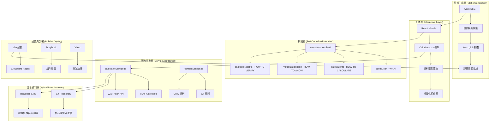

# 設計文件

## 概述

本設計文件描述了模組化醫療計算機系統的架構設計，堅守「前端優先」的 Jamstack 架構理念，採用 Astro + React Islands + TypeScript 技術棧。系統採用「資料驅動」的設計模式，透過清晰的抽象層實現模組化，並整合 Chart.js 視覺化庫提供豐富的結果呈現。設計重點在於最大化 Jamstack 優勢（極致效能、頂級安全性、低維護成本），同時透過服務層抽象保留未來後端整合的彈性。

## 架構

### Jamstack 架構圖



### Jamstack 技術棧

- **靜態生成**: Astro 5.x (SSG 優先，最大化效能)
- **互動島嶼**: React 19.x (Islands Architecture，最小化 JavaScript)
- **類型安全**: TypeScript 5.x (完整類型覆蓋)
- **樣式系統**: Tailwind CSS 4.x (原子化 CSS)
- **視覺化**: Chart.js 4.x + React-ChartJS-2 (輕量圖表庫)
- **組件開發**: Storybook (隔離組件開發)
- **測試框架**: Vitest + Testing Library (快速單元測試)
- **內容管理**: Git (核心邏輯) + Strapi (視覺化內容)
- **建置部署**: Vite + Cloudflare Pages (邊緣運算 CDN)
- **開發工具**: ESLint + Prettier (程式碼品質)

## 組件和介面

### 1. 自給自足的計算機模組

每個計算機模組都是一個完全獨立的「微應用」：

```
src/calculators/
├── bmi/                        # BMI 計算機模組
│   ├── config.json            # 定義 WHAT - 有什麼欄位、名稱、描述
│   ├── calculator.ts          # 定義 HOW TO CALCULATE - 純函式計算邏輯
│   ├── visualization.json     # 定義 HOW TO SHOW - 結果儀表板佈局
│   ├── calculator.test.ts     # 定義 HOW TO VERIFY - 確保邏輯準確
│   └── README.md             # 模組說明文件
├── cha2ds2-vasc/              # CHA₂DS₂-VASc 計算機模組
│   ├── config.json
│   ├── calculator.ts
│   ├── visualization.json
│   ├── calculator.test.ts
│   └── README.md
├── egfr/                      # eGFR 計算機模組
│   └── ... (相同結構)
└── _template/                 # 新模組開發模板
    ├── config.template.json
    ├── calculator.template.ts
    ├── visualization.template.json
    ├── calculator.template.test.ts
    └── README.template.md
```

**核心原則**：

- 每個資料夾 = 一個獨立的計算機
- 修改任何模組不影響其他模組
- 移除模組資料夾 = 自動從系統中移除該計算機
- 90% 的開發工作只需要編輯 JSON 和 TypeScript 檔案

### 2. 計算機配置介面

```typescript
interface CalculatorConfig {
  // 基本資訊
  id: string;
  name: Record<SupportedLocale, string>;
  description: Record<SupportedLocale, string>;
  category: MedicalCategory;
  version: string;
  status: "published" | "draft" | "deprecated";

  // 輸入欄位定義
  fields: CalculatorField[];

  // 計算配置
  calculation: {
    functionName: string;
    validationRules?: ValidationRules;
  };

  // 結果解釋
  interpretation: InterpretationRule[];

  // 視覺化配置
  visualization: VisualizationConfig;

  // 醫療資訊
  medical: {
    specialty: string[];
    evidenceLevel: "A" | "B" | "C" | "D";
    references: Reference[];
    clinicalGuidelines?: Record<SupportedLocale, string>;
  };

  // 元資料
  metadata: {
    tags: string[];
    difficulty: "basic" | "intermediate" | "advanced";
    lastUpdated: string;
    author: string;
    reviewedBy?: string;
  };
}

interface CalculatorField {
  id: string;
  type: "number" | "select" | "checkbox" | "radio" | "range";
  label: Record<SupportedLocale, string>;
  placeholder?: Record<SupportedLocale, string>;
  helpText?: Record<SupportedLocale, string>;
  required: boolean;

  // 數值欄位特有屬性
  min?: number;
  max?: number;
  step?: number;
  unit?: string;

  // 選擇欄位特有屬性
  options?: FieldOption[];

  // 條件顯示
  conditional?: {
    field: string;
    operator: "eq" | "ne" | "gt" | "lt" | "gte" | "lte";
    value: any;
  };

  // 驗證規則
  validation?: {
    pattern?: string;
    customValidator?: string;
    errorMessage?: Record<SupportedLocale, string>;
  };
}

interface VisualizationConfig {
  resultDisplay: {
    type: "card" | "dashboard" | "chart" | "gauge";
    layout: "single" | "grid" | "tabs";
    components: VisualizationComponent[];
  };

  charts?: ChartConfig[];

  riskIndicators?: RiskIndicatorConfig[];

  customComponents?: CustomComponentConfig[];
}
```

### 3. 計算邏輯介面 (純函式模式)

為保持 Jamstack 架構的簡潔性，統一採用純函式模式：

```typescript
// src/calculators/bmi/calculator.ts - 純函式實現
export function calculate(inputs: CalculatorInputs): CalculationResult {
  const { weight, height } = inputs;
  const heightInMeters = height / 100;
  const bmi = weight / (heightInMeters * heightInMeters);

  return {
    primaryValue: Math.round(bmi * 100) / 100,
    primaryUnit: "kg/m²",
    primaryLabel: { "zh-TW": "BMI 指數" },
    riskLevel: getBMIRiskLevel(bmi),
    interpretation: getBMIInterpretation(bmi),
    visualizationData: {
      bmiValue: bmi,
      categoryDistribution: getBMICategoryData(bmi),
    },
  };
}

export function validate(inputs: CalculatorInputs): ValidationResult {
  const errors: ValidationError[] = [];

  if (!inputs.weight || inputs.weight <= 0) {
    errors.push({ field: "weight", message: "體重必須大於 0" });
  }

  if (!inputs.height || inputs.height <= 0) {
    errors.push({ field: "height", message: "身高必須大於 0" });
  }

  return {
    isValid: errors.length === 0,
    errors,
  };
}

export function formatResult(
  result: CalculationResult,
  locale: SupportedLocale
): FormattedResult {
  return {
    displayValue: `${result.primaryValue} ${result.primaryUnit}`,
    description: result.interpretation[locale],
    recommendations: getLocalizedRecommendations(result, locale),
  };
}

// 輔助函式
function getBMIRiskLevel(bmi: number): RiskLevel {
  if (bmi < 18.5) return "moderate";
  if (bmi < 25) return "low";
  if (bmi < 30) return "moderate";
  return "high";
}
```

**純函式的優勢**：

- 更簡單、更容易理解和測試
- 支援 Tree-shaking，減少最終包大小
- 無副作用，更容易進行並行處理
- 更符合函數式程式設計原則

interface CalculationResult {
// 主要結果
primaryValue: number;
primaryUnit?: string;
primaryLabel: Record<SupportedLocale, string>;

// 次要結果
secondaryValues?: Array<{
value: number;
unit?: string;
label: Record<SupportedLocale, string>;
}>;

// 風險等級
riskLevel?: 'low' | 'moderate' | 'high' | 'critical';
riskScore?: number;

// 解釋和建議
interpretation: Record<SupportedLocale, string>;
recommendations?: Array<Record<SupportedLocale, string>>;

// 計算詳情
breakdown?: CalculationBreakdown[];

// 視覺化資料
visualizationData?: Record<string, any>;
}

interface CalculationBreakdown {
field: string;
label: Record<SupportedLocale, string>;
value: any;
contribution: number;
explanation?: Record<SupportedLocale, string>;
}

````

### 4. 視覺化組件介面

```typescript
interface VisualizationComponent {
  id: string;
  type: 'result-card' | 'risk-indicator' | 'chart' | 'gauge' | 'progress-bar' | 'comparison-table';
  title?: Record<SupportedLocale, string>;
  position: {
    row: number;
    col: number;
    span?: number;
  };
  config: ComponentConfig;
}

interface ResultCardConfig {
  valueKey: string;
  format: 'number' | 'percentage' | 'currency' | 'custom';
  precision?: number;
  showUnit: boolean;
  colorScheme: 'default' | 'risk-based' | 'custom';
  icon?: string;
  subtitle?: Record<SupportedLocale, string>;
}

interface RiskIndicatorConfig {
  riskKey: string;
  style: 'badge' | 'progress' | 'gauge' | 'traffic-light';
  thresholds: Array<{
    min: number;
    max: number;
    level: 'low' | 'moderate' | 'high' | 'critical';
    color: string;
    label: Record<SupportedLocale, string>;
  }>;
}

interface ChartConfig {
  chartType: 'line' | 'bar' | 'pie' | 'doughnut' | 'radar' | 'scatter';
  dataKey: string;
  options: Chart.ChartOptions;
  responsive: boolean;
  height?: number;
  plugins?: string[];
}
````

### 5. 服務抽象層 - 未來擴充性的關鍵

透過清晰的抽象層，在不增加當前複雜度的前提下為未來鋪路：

```typescript
// services/calculatorService.ts - 資料來源抽象
export class CalculatorService {
  // v1.0 實現 - 讀取本地檔案
  async getCalculatorConfig(id: string): Promise<CalculatorConfig> {
    // 在建置時，Astro 會讀取本地檔案
    const configs = await Astro.glob("../calculators/*/config.json");
    const config = configs.find((c) => c.default.id === id);
    return config?.default;
  }

  async getAllCalculators(): Promise<CalculatorConfig[]> {
    const configs = await Astro.glob("../calculators/*/config.json");
    return configs.map((c) => c.default);
  }

  // 未來 v2.0 只需修改這些方法，UI 組件完全不變
  /*
  async getCalculatorConfig(id: string): Promise<CalculatorConfig> {
    const response = await fetch(`https://api.yourdomain.com/calculators/${id}`);
    return response.json();
  }
  */
}

// services/contentService.ts - 內容管理抽象
export class ContentService {
  // v1.0 實現 - 混合資料源
  async getCalculatorContent(id: string, locale: string) {
    // Git 資料 (核心邏輯)
    const config = await this.calculatorService.getCalculatorConfig(id);

    // CMS 資料 (視覺化內容)
    const cmsContent = await this.getCMSContent(id, locale);

    // 合併資料
    return {
      ...config,
      description: cmsContent.description,
      instructions: cmsContent.instructions,
      references: cmsContent.references,
    };
  }
}

// components/Calculator.tsx - 無狀態 UI 引擎
interface CalculatorProps {
  config: CalculatorConfig;
  visualization: VisualizationConfig;
  locale: string;
}

export const Calculator: React.FC<CalculatorProps> = ({
  config,
  visualization,
  locale,
}) => {
  // 這個組件永遠不知道資料來自哪裡
  // 它只負責根據 props 渲染 UI
  // 未來資料來源改變時，這個組件完全不需要修改

  return (
    <div className="calculator">
      <CalculatorForm config={config} />
      <CalculatorResults visualization={visualization} />
    </div>
  );
};
```

**抽象層的好處**：

- UI 組件與資料來源完全解耦
- 未來轉換後端時，90% 的程式碼保持不變
- 只需修改服務層的實現，不需要重構 UI
- 測試更容易，可以輕鬆 mock 資料來源

## 資料模型

### 1. 計算機註冊表 (建置時動態生成)

**重要說明**：在 v1.0 Jamstack 架構中，CalculatorRegistry 不是一個持續運行的後端實體，而是在建置時或客戶端動態建立的輔助物件，用於提供方便的搜尋和分類介面。

```typescript
// utils/calculatorRegistry.ts - 建置時動態生成的註冊表
export class CalculatorRegistry {
  private calculators: Map<string, CalculatorModule> = new Map();
  private categories: Map<string, CalculatorModule[]> = new Map();
  private tags: Map<string, CalculatorModule[]> = new Map();

  constructor(modules: CalculatorModule[]) {
    // 在建置時或初始化時，從所有模組建立索引
    this.buildIndex(modules);
  }

  private buildIndex(modules: CalculatorModule[]): void {
    modules.forEach((module) => {
      // 建立主索引
      this.calculators.set(module.config.id, module);

      // 建立分類索引
      const category = module.config.category;
      if (!this.categories.has(category)) {
        this.categories.set(category, []);
      }
      this.categories.get(category)!.push(module);

      // 建立標籤索引
      module.config.metadata.tags.forEach((tag) => {
        if (!this.tags.has(tag)) {
          this.tags.set(tag, []);
        }
        this.tags.get(tag)!.push(module);
      });
    });
  }

  // 搜尋和查詢方法
  get(id: string): CalculatorModule | undefined {
    return this.calculators.get(id);
  }

  search(query: SearchQuery): CalculatorModule[] {
    let results = Array.from(this.calculators.values());

    if (query.category) {
      results = this.categories.get(query.category) || [];
    }

    if (query.tags?.length) {
      results = results.filter((module) =>
        query.tags!.some((tag) => module.config.metadata.tags.includes(tag))
      );
    }

    if (query.text) {
      results = results.filter(
        (module) =>
          module.config.name["zh-TW"]
            .toLowerCase()
            .includes(query.text!.toLowerCase()) ||
          module.config.description["zh-TW"]
            .toLowerCase()
            .includes(query.text!.toLowerCase())
      );
    }

    return results;
  }

  getCategoryStats(): Record<string, number> {
    const stats: Record<string, number> = {};
    this.categories.forEach((modules, category) => {
      stats[category] = modules.length;
    });
    return stats;
  }
}

// services/calculatorService.ts - 使用註冊表
export class CalculatorService {
  private registry: CalculatorRegistry | null = null;

  async getRegistry(): Promise<CalculatorRegistry> {
    if (!this.registry) {
      // 在首次使用時建立註冊表
      const modules = await this.loadAllModules();
      this.registry = new CalculatorRegistry(modules);
    }
    return this.registry;
  }

  async searchCalculators(query: SearchQuery): Promise<CalculatorModule[]> {
    const registry = await this.getRegistry();
    return registry.search(query);
  }
}
```

**實現特點**：

- 建置時從所有模組自動生成索引
- 客戶端快速搜尋和分類
- 無需後端資料庫，完全靜態化
- 支援複雜的查詢和篩選功能

### 2. 使用統計模型

```typescript
interface UsageStats {
  calculatorId: string;
  timestamp: Date;
  sessionId: string;
  inputs: Record<string, any>;
  result: CalculationResult;
  userAgent: string;
  locale: SupportedLocale;
  completionTime: number;
  errors?: string[];
}

interface AnalyticsData {
  totalUsage: number;
  popularCalculators: Array<{
    id: string;
    name: string;
    usageCount: number;
  }>;
  categoryDistribution: Record<string, number>;
  errorRates: Record<string, number>;
  averageCompletionTime: Record<string, number>;
}
```

## 錯誤處理

### 1. 錯誤邊界策略

```typescript
interface CalculatorErrorBoundary extends React.Component {
  state: {
    hasError: boolean;
    error?: Error;
    errorInfo?: React.ErrorInfo;
  };

  static getDerivedStateFromError(error: Error): Partial<State>;
  componentDidCatch(error: Error, errorInfo: React.ErrorInfo): void;

  render(): React.ReactNode;
}

// 錯誤類型定義
enum CalculatorErrorType {
  CONFIG_ERROR = "CONFIG_ERROR",
  CALCULATION_ERROR = "CALCULATION_ERROR",
  VALIDATION_ERROR = "VALIDATION_ERROR",
  VISUALIZATION_ERROR = "VISUALIZATION_ERROR",
  NETWORK_ERROR = "NETWORK_ERROR",
}

interface CalculatorError extends Error {
  type: CalculatorErrorType;
  calculatorId: string;
  context?: Record<string, any>;
  recoverable: boolean;
}
```

### 2. 錯誤恢復機制

```typescript
interface ErrorRecoveryStrategy {
  // 嘗試恢復錯誤
  recover(error: CalculatorError): Promise<boolean>;

  // 提供降級功能
  fallback(calculatorId: string): React.ComponentType;

  // 記錄錯誤
  logError(error: CalculatorError): void;
}

// 具體恢復策略
class CalculationErrorRecovery implements ErrorRecoveryStrategy {
  async recover(error: CalculatorError): Promise<boolean> {
    // 嘗試使用備用計算方法
    // 或提供簡化版本的計算
    return false;
  }

  fallback(calculatorId: string): React.ComponentType {
    // 返回錯誤提示組件
    return ErrorFallbackComponent;
  }

  logError(error: CalculatorError): void {
    // 發送錯誤報告到分析系統
    console.error(`Calculator Error [${error.calculatorId}]:`, error);
  }
}
```

## 測試策略

### 1. 測試層級

```typescript
// 單元測試 - 純函式計算邏輯
import { calculate, validate } from "../bmi/calculator";

describe("BMI Calculator", () => {
  test("should calculate BMI correctly", () => {
    const result = calculate({
      weight: 70,
      height: 175,
    });

    expect(result.primaryValue).toBeCloseTo(22.86, 2);
    expect(result.riskLevel).toBe("low");
    expect(result.primaryUnit).toBe("kg/m²");
  });

  test("should validate inputs correctly", () => {
    const validationResult = validate({
      weight: -10,
      height: 175,
    });

    expect(validationResult.isValid).toBe(false);
    expect(validationResult.errors).toHaveLength(1);
    expect(validationResult.errors[0].field).toBe("weight");
  });

  test("should handle edge cases", () => {
    const result = calculate({
      weight: 0,
      height: 0,
    });

    expect(result.primaryValue).toBe(0);
    expect(result.riskLevel).toBe("critical");
  });
});

// 整合測試 - 組件互動
describe("Calculator Integration", () => {
  test("should render calculator with correct config", async () => {
    const { getByRole, getByLabelText } = render(
      <CalculatorEngine calculatorId="bmi-calculator" />
    );

    expect(getByRole("heading")).toHaveTextContent("BMI 計算機");
    expect(getByLabelText("體重 (kg)")).toBeInTheDocument();
  });
});

// E2E 測試 - 完整流程
describe("Calculator E2E", () => {
  test("should complete calculation flow", async () => {
    await page.goto("/tools/bmi");

    await page.fill('[data-testid="weight-input"]', "70");
    await page.fill('[data-testid="height-input"]', "175");
    await page.click('[data-testid="calculate-button"]');

    await expect(page.locator('[data-testid="result-value"]')).toContainText(
      "22.86"
    );
  });
});
```

### 2. 測試工具配置

```typescript
// vitest.config.ts
export default defineConfig({
  test: {
    environment: "jsdom",
    setupFiles: ["./src/test/setup.ts"],
    coverage: {
      provider: "v8",
      reporter: ["text", "json", "html"],
      exclude: ["node_modules/", "src/test/", "**/*.d.ts", "**/*.config.*"],
    },
  },
});

// 測試輔助工具
export class CalculatorTestUtils {
  static createMockCalculator(
    config: Partial<CalculatorConfig>
  ): CalculatorModule {
    return {
      config: { ...defaultConfig, ...config },
      calculator: new MockCalculator(),
      tests: new MockTestSuite(),
      visualization: defaultVisualizationConfig,
    };
  }

  static mockCalculationResult(
    overrides: Partial<CalculationResult>
  ): CalculationResult {
    return {
      primaryValue: 0,
      primaryLabel: { "zh-TW": "結果" },
      interpretation: { "zh-TW": "正常範圍" },
      ...overrides,
    };
  }
}
```

## 視覺化設計

### 1. Storybook 驅動的組件庫開發

**開發流程**：優先在 Storybook 中開發所有可重複使用的視覺化組件

```typescript
// src/components/visualization/ResultCard.tsx
interface ResultCardProps {
  value: number;
  unit?: string;
  label: string;
  subtitle?: string;
  riskLevel?: "low" | "moderate" | "high" | "critical";
  icon?: string;
  format?: "number" | "percentage" | "currency";
  precision?: number;
  size?: "sm" | "md" | "lg";
}

export const ResultCard: React.FC<ResultCardProps> = ({
  value,
  unit,
  label,
  subtitle,
  riskLevel,
  icon,
  format = "number",
  precision = 2,
  size = "md",
}) => {
  const formattedValue = formatValue(value, format, precision);
  const cardStyles = getCardStyles(riskLevel, size);

  return (
    <div className={`result-card ${cardStyles}`}>
      <div className="result-card-header">
        {icon && <Icon name={icon} className="result-card-icon" />}
        <h3 className="result-card-title">{label}</h3>
      </div>
      <div className="result-card-body">
        <div className="result-value">
          <span className="value-number">{formattedValue}</span>
          {unit && <span className="value-unit">{unit}</span>}
        </div>
        {subtitle && <p className="result-subtitle">{subtitle}</p>}
      </div>
      {riskLevel && <RiskBadge level={riskLevel} />}
    </div>
  );
};

// src/components/visualization/ResultCard.stories.tsx
export default {
  title: "Visualization/ResultCard",
  component: ResultCard,
  parameters: {
    docs: {
      description: {
        component: "用於顯示計算結果的卡片組件，支援多種格式和風險等級指示",
      },
    },
  },
};

export const BMIResult = {
  args: {
    value: 22.86,
    unit: "kg/m²",
    label: "BMI 指數",
    subtitle: "正常範圍",
    riskLevel: "low",
    icon: "scale",
    format: "number",
    precision: 2,
  },
};

export const HighRiskScore = {
  args: {
    value: 85,
    unit: "%",
    label: "心血管風險",
    subtitle: "需要立即關注",
    riskLevel: "critical",
    icon: "heart",
    format: "percentage",
  },
};

export const AllSizes = {
  render: () => (
    <div className="flex gap-4">
      <ResultCard {...BMIResult.args} size="sm" />
      <ResultCard {...BMIResult.args} size="md" />
      <ResultCard {...BMIResult.args} size="lg" />
    </div>
  ),
};
```

**Storybook 的優勢**：

- 隔離組件開發，不受其他系統影響
- 視覺化測試所有組件狀態和變體
- 自動生成組件文檔
- 設計師和開發者協作的共同語言
- 確保組件在各種情況下都能正常工作

// 風險指示器組件
interface RiskIndicatorProps {
level: RiskLevel;
style?: 'badge' | 'progress' | 'gauge';
showLabel?: boolean;
size?: 'sm' | 'md' | 'lg';
}

const RiskIndicator: React.FC<RiskIndicatorProps> = ({
level,
style = 'badge',
showLabel = true,
size = 'md'
}) => {
const config = getRiskConfig(level);

switch (style) {
case 'badge':
return (
<span className={`risk-badge risk-${level} size-${size}`}>
{config.icon}
{showLabel && config.label}
</span>
);

    case 'progress':
      return (
        <div className="risk-progress">
          <div className="progress-bar">
            <div
              className={`progress-fill risk-${level}`}
              style={{ width: `${config.percentage}%` }}
            />
          </div>
          {showLabel && <span className="progress-label">{config.label}</span>}
        </div>
      );

    case 'gauge':
      return <RiskGauge level={level} showLabel={showLabel} size={size} />;

    default:
      return null;

}
};

````

### 2. 圖表整合

```typescript
// 圖表組件包裝器
interface CalculatorChartProps {
  type: 'line' | 'bar' | 'pie' | 'doughnut' | 'radar';
  data: ChartData;
  options?: ChartOptions;
  height?: number;
  responsive?: boolean;
}

const CalculatorChart: React.FC<CalculatorChartProps> = ({
  type,
  data,
  options = {},
  height = 300,
  responsive = true
}) => {
  const defaultOptions: ChartOptions = {
    responsive,
    maintainAspectRatio: !height,
    plugins: {
      legend: {
        position: 'top' as const,
      },
      tooltip: {
        backgroundColor: 'rgba(0, 0, 0, 0.8)',
        titleColor: '#fff',
        bodyColor: '#fff',
        borderColor: '#3b82f6',
        borderWidth: 1,
      },
    },
    scales: type !== 'pie' && type !== 'doughnut' ? {
      y: {
        beginAtZero: true,
        grid: {
          color: 'rgba(0, 0, 0, 0.1)',
        },
      },
      x: {
        grid: {
          color: 'rgba(0, 0, 0, 0.1)',
        },
      },
    } : undefined,
  };

  const mergedOptions = { ...defaultOptions, ...options };

  const ChartComponent = getChartComponent(type);

  return (
    <div className="calculator-chart" style={{ height: height ? `${height}px` : 'auto' }}>
      <ChartComponent data={data} options={mergedOptions} />
    </div>
  );
};

// 圖表資料轉換器
class ChartDataTransformer {
  static transformForBMIChart(result: CalculationResult): ChartData {
    const bmi = result.primaryValue;
    const categories = [
      { label: '體重過輕', min: 0, max: 18.5, color: '#60a5fa' },
      { label: '正常範圍', min: 18.5, max: 25, color: '#34d399' },
      { label: '體重過重', min: 25, max: 30, color: '#fbbf24' },
      { label: '肥胖', min: 30, max: 50, color: '#f87171' }
    ];

    return {
      labels: categories.map(cat => cat.label),
      datasets: [{
        data: categories.map(cat =>
          bmi >= cat.min && bmi < cat.max ? bmi : 0
        ),
        backgroundColor: categories.map(cat => cat.color),
        borderWidth: 2,
        borderColor: '#fff'
      }]
    };
  }

  static transformForRiskChart(result: CalculationResult): ChartData {
    // 實現風險評估圖表資料轉換
    return {
      labels: ['低風險', '中風險', '高風險'],
      datasets: [{
        label: '風險分布',
        data: [30, 50, 20],
        backgroundColor: ['#34d399', '#fbbf24', '#f87171']
      }]
    };
  }
}
````

### 3. 儀表板佈局

```typescript
// 儀表板組件
interface DashboardProps {
  result: CalculationResult;
  config: VisualizationConfig;
  locale: SupportedLocale;
}

const CalculatorDashboard: React.FC<DashboardProps> = ({
  result,
  config,
  locale,
}) => {
  const { resultDisplay } = config;

  return (
    <div className={`calculator-dashboard layout-${resultDisplay.layout}`}>
      {resultDisplay.components.map((component, index) => (
        <div
          key={component.id}
          className="dashboard-item"
          style={{
            gridRow: component.position.row,
            gridColumn: `${component.position.col} / span ${
              component.position.span || 1
            }`,
          }}
        >
          <DashboardComponent
            component={component}
            result={result}
            locale={locale}
          />
        </div>
      ))}
    </div>
  );
};

// 動態組件渲染器
const DashboardComponent: React.FC<{
  component: VisualizationComponent;
  result: CalculationResult;
  locale: SupportedLocale;
}> = ({ component, result, locale }) => {
  switch (component.type) {
    case "result-card":
      return (
        <ResultCard {...component.config} result={result} locale={locale} />
      );

    case "risk-indicator":
      return <RiskIndicator {...component.config} result={result} />;

    case "chart":
      const chartData = transformChartData(result, component.config);
      return <CalculatorChart {...component.config} data={chartData} />;

    case "gauge":
      return <GaugeChart {...component.config} result={result} />;

    case "progress-bar":
      return <ProgressBar {...component.config} result={result} />;

    case "comparison-table":
      return (
        <ComparisonTable
          {...component.config}
          result={result}
          locale={locale}
        />
      );

    default:
      return <div>未知組件類型: {component.type}</div>;
  }
};
```

## v1.0 成功路徑實施計劃

### 階段 1：基礎設施建立 (Week 1-2)

```bash
# 1. 初始化 Astro 專案
npm create astro@latest astro-medical-calculators
cd astro-medical-calculators

# 2. 整合核心技術棧
npx astro add react tailwind
npm install chart.js react-chartjs-2
npm install -D vitest @testing-library/react @testing-library/jest-dom

# 3. 設定 Storybook
npx storybook@latest init
npm install -D @storybook/addon-docs @storybook/addon-a11y

# 4. 建立專案結構
mkdir -p src/calculators/_template
mkdir -p src/components/visualization
mkdir -p src/services
mkdir -p src/utils
```

### 階段 2：CMS 設定與組件庫開發 (Week 3-4)

**Week 3：提早設定 Strapi CMS**

```bash
# 1. 設定 Strapi CMS
npx create-strapi-app@latest cms --quickstart
cd cms

# 2. 配置內容類型
# - 衛教文章 (Education Articles)
# - 多語言翻譯 (Translations)
# - 計算機說明 (Calculator Descriptions)
# - 參考文獻 (References)

# 3. 建立測試資料
# 為前端開發提供真實的 API 端點
```

**Week 4：Storybook 組件庫開發**

```typescript
// 核心組件清單
src/components/visualization/
├── ResultCard.tsx & .stories.tsx      # 結果卡片
├── RiskIndicator.tsx & .stories.tsx   # 風險指示器
├── GaugeChart.tsx & .stories.tsx      # 儀表圖
├── ProgressBar.tsx & .stories.tsx     # 進度條
├── Dashboard.tsx & .stories.tsx       # 儀表板佈局
├── CalculatorChart.tsx & .stories.tsx # 圖表組件
└── ComparisonTable.tsx & .stories.tsx # 比較表格
```

**提早設定 CMS 的好處**：

- 前端開發時可直接對接真實 API 端點
- 提早發現資料結構和整合問題
- 內容管理者可同步開始準備內容
- 避免後期大量的資料遷移工作

### 階段 3：核心引擎開發 (Week 5-6)

```typescript
// 服務層實現
src/services/
├── calculatorService.ts    # 計算機資料服務
├── contentService.ts       # 內容管理服務
└── visualizationService.ts # 視覺化服務

// 核心引擎
src/components/
├── Calculator.tsx          # 資料驅動的 UI 引擎
├── CalculatorForm.tsx      # 動態表單生成器
├── CalculatorResults.tsx   # 結果展示引擎
└── ErrorBoundary.tsx       # 錯誤邊界
```

### 階段 4：模組實作驗證 (Week 7-8)

建立 2-3 個真實計算機模組來驗證架構：

```
src/calculators/
├── bmi/                    # BMI 計算機 (簡單)
├── cha2ds2-vasc/          # CHA₂DS₂-VASc (中等複雜度)
└── egfr/                  # eGFR 計算 (複雜)
```

每個模組包含完整的配置、邏輯、測試和視覺化定義。

### 階段 5：頁面整合 (Week 9-10)

```typescript
// Astro 頁面
src/pages/
├── index.astro                    # 首頁
├── tools/
│   ├── index.astro               # 計算機總覽
│   └── [calculator].astro        # 動態計算機頁面
└── api/
    └── calculators.json.ts       # API 端點 (未來擴展用)
```

### 階段 6：生產部署與優化 (Week 11-12)

```bash
# 1. 部署到 Cloudflare Pages
# 設定自動化 CI/CD 流程
# 配置 CMS webhook 觸發重新建置

# 2. 效能優化
# 圖片優化、程式碼分割、快取策略
# Lighthouse 效能調優

# 3. 監控與分析
# 設定錯誤追蹤 (Sentry)
# 整合使用分析 (Plausible)
# 建立效能監控儀表板

# 4. 安全性強化
# CSP 設定、HTTPS 強制
# 依賴套件安全性掃描
```

### 成功指標

- ✅ 所有組件在 Storybook 中完整展示
- ✅ 至少 3 個計算機模組正常運作
- ✅ 測試覆蓋率 > 80%
- ✅ Lighthouse 效能分數 > 90
- ✅ 完整的 TypeScript 類型覆蓋
- ✅ 響應式設計支援所有裝置
- ✅ 無障礙性 (a11y) 合規

### 技術債務管理

- 定期重構和程式碼審查
- 持續整合和自動化測試
- 效能監控和優化
- 安全性掃描和更新

這個設計確保了系統的可維護性、擴展性和未來適應性，同時最大化了 Jamstack 架構的優勢。
