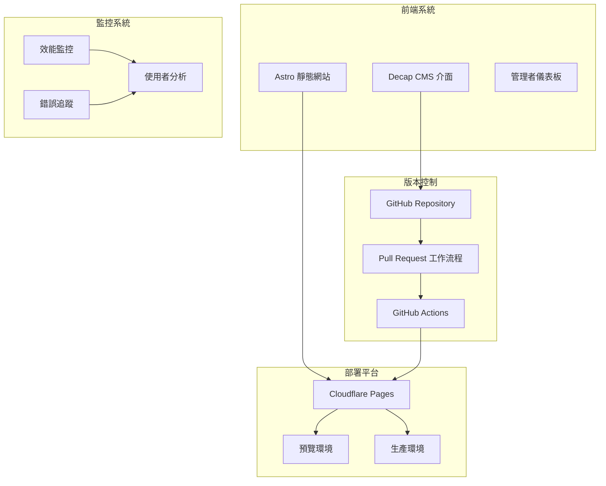

# 管理者手冊

## 系統管理和設定指南

本手冊為系統管理者提供完整的系統管理、使用者管理、權限控制和監控指導。

## 目錄

1. [管理者職責概述](#管理者職責概述)
2. [系統架構管理](#系統架構管理)
3. [使用者與權限管理](#使用者與權限管理)
4. [內容發布管理](#內容發布管理)
5. [品質監控與分析](#品質監控與分析)
6. [系統維護與備份](#系統維護與備份)
7. [安全性管理](#安全性管理)
8. [故障排除與支援](#故障排除與支援)

## 管理者職責概述

### 主要職責

1. **系統運維管理**
   - 監控系統運行狀態
   - 管理伺服器資源和效能
   - 執行系統更新和維護
   - 處理技術故障和問題

2. **使用者管理**
   - 管理使用者帳號和權限
   - 審核新使用者申請
   - 處理權限變更請求
   - 管理審核者分配

3. **內容管理**
   - 監控內容品質和合規性
   - 管理發布流程和時程
   - 處理內容爭議和申訴
   - 維護內容標準和指引

4. **安全管理**
   - 實施安全政策和程序
   - 監控安全威脅和漏洞
   - 管理存取控制和認證
   - 執行安全稽核和評估

### 管理工具存取

**主要管理介面：**
- **GitHub 組織管理**：https://github.com/orgs/your-org/settings
- **Cloudflare Pages 控制台**：https://dash.cloudflare.com/
- **系統監控儀表板**：https://your-domain.com/admin/dashboard
- **使用者管理介面**：https://your-domain.com/admin/users

**必要權限：**
- GitHub 組織 Owner 權限
- Cloudflare 帳號管理權限
- 系統管理者角色
- 資料庫管理權限

## 系統架構管理

### 系統組件概覽



### GitHub 組織管理

#### 儲存庫設定

1. **分支保護規則**
   ```yaml
   # .github/branch-protection.yml
   protection_rules:
     main:
       required_status_checks:
         - content-quality-check
         - accessibility-check
         - medical-terminology-check
       required_reviews: 2
       dismiss_stale_reviews: true
       require_code_owner_reviews: true
       restrictions:
         users: []
         teams: ["admin-team"]
   ```

2. **CODEOWNERS 設定**
   ```
   # .github/CODEOWNERS
   
   # 全域管理者
   * @admin-team
   
   # 專科特定審核者
   /src/content/education/*cardiology* @cardiology-reviewers @medical-editors
   /src/content/education/*pediatrics* @pediatrics-reviewers @medical-editors
   /src/content/education/*neurology* @neurology-reviewers @medical-editors
   
   # 系統設定檔案
   /.github/ @admin-team @tech-team
   /public/admin/ @admin-team @tech-team
   ```

3. **團隊管理**
   - **admin-team**：系統管理者
   - **tech-team**：技術開發團隊
   - **medical-editors**：醫學編輯團隊
   - **cardiology-reviewers**：心臟科審核者
   - **pediatrics-reviewers**：小兒科審核者
   - **neurology-reviewers**：神經科審核者

#### GitHub Actions 管理

1. **工作流程監控**
   ```bash
   # 查看工作流程狀態
   gh workflow list
   
   # 查看特定工作流程的執行歷史
   gh run list --workflow="Content Quality Check"
   
   # 查看失敗的工作流程詳情
   gh run view [RUN_ID] --log-failed
   ```

2. **Secrets 管理**
   ```yaml
   # 必要的 Secrets 設定
   CLOUDFLARE_API_TOKEN: "your-cloudflare-api-token"
   GITHUB_TOKEN: "auto-generated"
   MEDICAL_TERMINOLOGY_API_KEY: "your-api-key"
   NOTIFICATION_WEBHOOK_URL: "your-webhook-url"
   ```

### Cloudflare Pages 管理

#### 部署設定

1. **建置設定**
   ```yaml
   # cloudflare-pages.yml
   build:
     command: "npm run build"
     output_directory: "dist"
     environment_variables:
       NODE_VERSION: "18"
       NPM_VERSION: "9"
   
   preview:
     enabled: true
     branch_pattern: "*"
     
   production:
     branch: "main"
     custom_domain: "your-domain.com"
   ```

2. **環境變數管理**
   - **SITE_URL**：網站主要網址
   - **CMS_REPO**：GitHub 儲存庫路徑
   - **GITHUB_CLIENT_ID**：GitHub OAuth 應用程式 ID
   - **ANALYTICS_ID**：分析工具 ID

#### 自訂網域設定

1. **DNS 設定**
   ```
   Type: CNAME
   Name: your-domain.com
   Value: your-pages-project.pages.dev
   TTL: Auto
   ```

2. **SSL 憑證**
   - 啟用 Cloudflare 的 Universal SSL
   - 設定 HTTPS 重導向
   - 配置 HSTS 標頭

### 監控與分析

#### 效能監控

1. **Core Web Vitals 監控**
   ```javascript
   // src/utils/performance-monitor.js
   export class PerformanceMonitor {
     static trackCoreWebVitals() {
       // LCP (Largest Contentful Paint)
       new PerformanceObserver((list) => {
         const entries = list.getEntries();
         const lastEntry = entries[entries.length - 1];
         console.log('LCP:', lastEntry.startTime);
         this.sendMetric('lcp', lastEntry.startTime);
       }).observe({ entryTypes: ['largest-contentful-paint'] });
       
       // FID (First Input Delay)
       new PerformanceObserver((list) => {
         const entries = list.getEntries();
         entries.forEach((entry) => {
           console.log('FID:', entry.processingStart - entry.startTime);
           this.sendMetric('fid', entry.processingStart - entry.startTime);
         });
       }).observe({ entryTypes: ['first-input'] });
       
       // CLS (Cumulative Layout Shift)
       let clsValue = 0;
       new PerformanceObserver((list) => {
         const entries = list.getEntries();
         entries.forEach((entry) => {
           if (!entry.hadRecentInput) {
             clsValue += entry.value;
           }
         });
         console.log('CLS:', clsValue);
         this.sendMetric('cls', clsValue);
       }).observe({ entryTypes: ['layout-shift'] });
     }
   }
   ```

2. **錯誤追蹤**
   ```javascript
   // src/utils/error-tracking.js
   export class ErrorTracker {
     static init() {
       window.addEventListener('error', (event) => {
         this.logError({
           type: 'javascript-error',
           message: event.message,
           filename: event.filename,
           lineno: event.lineno,
           colno: event.colno,
           stack: event.error?.stack
         });
       });
       
       window.addEventListener('unhandledrejection', (event) => {
         this.logError({
           type: 'promise-rejection',
           message: event.reason?.message || 'Unhandled Promise Rejection',
           stack: event.reason?.stack
         });
       });
     }
   }
   ```

## 使用者與權限管理

### 使用者角色定義

```yaml
# 角色權限矩陣
roles:
  admin:
    permissions:
      - system_management
      - user_management
      - content_publish
      - all_content_access
      - analytics_access
      
  medical_editor:
    permissions:
      - content_review
      - content_edit
      - quality_check
      - analytics_view
      
  specialty_reviewer:
    permissions:
      - specialty_content_review
      - content_comment
      - preview_access
      
  content_writer:
    permissions:
      - content_create
      - content_edit_own
      - draft_management
      
  viewer:
    permissions:
      - published_content_view
```

### GitHub 團隊管理

#### 建立新團隊

```bash
# 使用 GitHub CLI 建立團隊
gh api orgs/your-org/teams \
  --method POST \
  --field name="cardiology-reviewers" \
  --field description="心臟科審核者團隊" \
  --field privacy="closed"

# 新增成員到團隊
gh api orgs/your-org/teams/cardiology-reviewers/memberships/username \
  --method PUT \
  --field role="member"
```

#### 權限管理腳本

```javascript
// scripts/manage-permissions.js
import { Octokit } from '@octokit/rest';

class PermissionManager {
  constructor(token) {
    this.octokit = new Octokit({ auth: token });
  }
  
  async addUserToTeam(org, teamSlug, username, role = 'member') {
    try {
      await this.octokit.teams.addOrUpdateMembershipForUserInOrg({
        org,
        team_slug: teamSlug,
        username,
        role
      });
      console.log(`✅ Added ${username} to ${teamSlug} as ${role}`);
    } catch (error) {
      console.error(`❌ Failed to add ${username} to ${teamSlug}:`, error.message);
    }
  }
  
  async removeUserFromTeam(org, teamSlug, username) {
    try {
      await this.octokit.teams.removeMembershipForUserInOrg({
        org,
        team_slug: teamSlug,
        username
      });
      console.log(`✅ Removed ${username} from ${teamSlug}`);
    } catch (error) {
      console.error(`❌ Failed to remove ${username} from ${teamSlug}:`, error.message);
    }
  }
  
  async listTeamMembers(org, teamSlug) {
    try {
      const { data } = await this.octokit.teams.listMembersInOrg({
        org,
        team_slug: teamSlug
      });
      return data.map(member => ({
        username: member.login,
        role: member.role || 'member'
      }));
    } catch (error) {
      console.error(`❌ Failed to list members of ${teamSlug}:`, error.message);
      return [];
    }
  }
}

// 使用範例
const pm = new PermissionManager(process.env.GITHUB_TOKEN);

// 新增使用者到心臟科審核團隊
await pm.addUserToTeam('your-org', 'cardiology-reviewers', 'dr-chen');

// 列出所有團隊成員
const members = await pm.listTeamMembers('your-org', 'cardiology-reviewers');
console.log('Team members:', members);
```

### Decap CMS 使用者管理

#### 使用者認證設定

```yaml
# public/admin/config.yml
backend:
  name: github
  repo: your-org/health-education-platform
  branch: main
  auth_endpoint: https://your-domain.com/api/auth
  
# 使用者角色設定
collections:
  - name: "education"
    label: "衛教文章"
    folder: "src/content/education"
    create: true
    slug: "{{year}}-{{month}}-{{day}}-{{slug}}"
    editor:
      preview: true
    fields:
      # ... 其他欄位
    # 角色權限控制
    access:
      create: ["admin", "medical_editor", "content_writer"]
      update: ["admin", "medical_editor", "content_writer"]
      delete: ["admin"]
      publish: ["admin", "medical_editor"]
```

#### 使用者審核流程

1. **新使用者申請**
   ```javascript
   // scripts/user-approval.js
   class UserApprovalSystem {
     async processNewUserRequest(userData) {
       // 驗證使用者資格
       const isQualified = await this.verifyUserQualifications(userData);
       
       if (isQualified) {
         // 建立 GitHub 邀請
         await this.createGitHubInvitation(userData.githubUsername);
         
         // 分配適當的團隊
         await this.assignUserToTeams(userData);
         
         // 發送歡迎郵件
         await this.sendWelcomeEmail(userData);
         
         console.log(`✅ Approved user: ${userData.email}`);
       } else {
         // 發送拒絕通知
         await this.sendRejectionEmail(userData);
         console.log(`❌ Rejected user: ${userData.email}`);
       }
     }
   }
   ```

## 內容發布管理

### 發布流程控制

#### 自動化發布設定

```yaml
# .github/workflows/auto-publish.yml
name: Auto Publish Approved Content

on:
  pull_request:
    types: [closed]
    branches: [main]

jobs:
  auto-publish:
    if: github.event.pull_request.merged == true
    runs-on: ubuntu-latest
    steps:
      - name: Check if content is ready for publish
        id: check-status
        run: |
          # 檢查 PR 標籤是否包含 "ready-to-publish"
          if [[ "${{ contains(github.event.pull_request.labels.*.name, 'ready-to-publish') }}" == "true" ]]; then
            echo "publish=true" >> $GITHUB_OUTPUT
          else
            echo "publish=false" >> $GITHUB_OUTPUT
          fi
      
      - name: Trigger deployment
        if: steps.check-status.outputs.publish == 'true'
        uses: actions/github-script@v6
        with:
          script: |
            // 觸發 Cloudflare Pages 部署
            await github.rest.repos.createDispatchEvent({
              owner: context.repo.owner,
              repo: context.repo.repo,
              event_type: 'deploy-production'
            });
      
      - name: Notify stakeholders
        if: steps.check-status.outputs.publish == 'true'
        run: |
          # 發送發布通知
          curl -X POST "${{ secrets.NOTIFICATION_WEBHOOK_URL }}" \
            -H "Content-Type: application/json" \
            -d '{
              "text": "🚀 New content published: ${{ github.event.pull_request.title }}",
              "url": "${{ github.event.pull_request.html_url }}"
            }'
```

#### 手動發布控制

```javascript
// src/utils/publish-manager.js
export class PublishManager {
  constructor(githubToken) {
    this.octokit = new Octokit({ auth: githubToken });
  }
  
  async publishContent(prNumber, adminUser) {
    try {
      // 檢查管理者權限
      const hasPermission = await this.checkAdminPermission(adminUser);
      if (!hasPermission) {
        throw new Error('Insufficient permissions');
      }
      
      // 獲取 PR 資訊
      const pr = await this.octokit.pulls.get({
        owner: 'your-org',
        repo: 'health-education-platform',
        pull_number: prNumber
      });
      
      // 檢查 PR 狀態
      if (pr.data.state !== 'open') {
        throw new Error('PR is not open');
      }
      
      // 檢查所有檢查是否通過
      const checks = await this.octokit.checks.listForRef({
        owner: 'your-org',
        repo: 'health-education-platform',
        ref: pr.data.head.sha
      });
      
      const allChecksPassed = checks.data.check_runs.every(
        check => check.conclusion === 'success'
      );
      
      if (!allChecksPassed) {
        throw new Error('Not all checks have passed');
      }
      
      // 新增 ready-to-publish 標籤
      await this.octokit.issues.addLabels({
        owner: 'your-org',
        repo: 'health-education-platform',
        issue_number: prNumber,
        labels: ['ready-to-publish']
      });
      
      // 合併 PR
      await this.octokit.pulls.merge({
        owner: 'your-org',
        repo: 'health-education-platform',
        pull_number: prNumber,
        commit_title: `Publish: ${pr.data.title}`,
        merge_method: 'squash'
      });
      
      console.log(`✅ Successfully published PR #${prNumber}`);
      return { success: true, message: 'Content published successfully' };
      
    } catch (error) {
      console.error(`❌ Failed to publish PR #${prNumber}:`, error.message);
      return { success: false, error: error.message };
    }
  }
}
```

### 內容品質監控

#### 品質指標追蹤

```javascript
// src/utils/quality-metrics.js
export class QualityMetrics {
  static async generateQualityReport() {
    const metrics = {
      totalArticles: 0,
      publishedArticles: 0,
      averageReviewTime: 0,
      qualityScores: {},
      commonIssues: []
    };
    
    // 分析所有文章
    const articles = await this.getAllArticles();
    metrics.totalArticles = articles.length;
    
    // 計算發布率
    const publishedArticles = articles.filter(a => a.status === 'published');
    metrics.publishedArticles = publishedArticles.length;
    
    // 計算平均審核時間
    const reviewTimes = articles
      .filter(a => a.reviewCompletedAt && a.reviewStartedAt)
      .map(a => a.reviewCompletedAt - a.reviewStartedAt);
    
    if (reviewTimes.length > 0) {
      metrics.averageReviewTime = reviewTimes.reduce((a, b) => a + b, 0) / reviewTimes.length;
    }
    
    // 分析品質分數
    metrics.qualityScores = await this.calculateQualityScores(articles);
    
    // 識別常見問題
    metrics.commonIssues = await this.identifyCommonIssues(articles);
    
    return metrics;
  }
  
  static async calculateQualityScores(articles) {
    const scores = {
      medical_accuracy: 0,
      content_structure: 0,
      language_quality: 0,
      accessibility: 0
    };
    
    for (const article of articles) {
      const qualityChecks = await this.getQualityChecks(article.id);
      
      Object.keys(scores).forEach(metric => {
        if (qualityChecks[metric]) {
          scores[metric] += qualityChecks[metric].score || 0;
        }
      });
    }
    
    // 計算平均分數
    Object.keys(scores).forEach(metric => {
      scores[metric] = scores[metric] / articles.length;
    });
    
    return scores;
  }
}
```

#### 自動品質檢查

```javascript
// scripts/quality-checker.js
import { MedicalTerminologyChecker } from './medical-terminology-checker.js';
import { AccessibilityValidator } from './accessibility-validator.js';
import { ReadabilityAnalyzer } from './readability-analyzer.js';

export class AutoQualityChecker {
  constructor() {
    this.checkers = [
      new MedicalTerminologyChecker(),
      new AccessibilityValidator(),
      new ReadabilityAnalyzer()
    ];
  }
  
  async runAllChecks(articleContent, metadata) {
    const results = {
      overall_score: 0,
      checks: {},
      issues: [],
      recommendations: []
    };
    
    for (const checker of this.checkers) {
      try {
        const checkResult = await checker.check(articleContent, metadata);
        results.checks[checker.name] = checkResult;
        
        if (checkResult.issues) {
          results.issues.push(...checkResult.issues);
        }
        
        if (checkResult.recommendations) {
          results.recommendations.push(...checkResult.recommendations);
        }
        
        results.overall_score += checkResult.score || 0;
        
      } catch (error) {
        console.error(`Quality check failed for ${checker.name}:`, error);
        results.checks[checker.name] = {
          status: 'error',
          message: error.message
        };
      }
    }
    
    // 計算總體分數
    results.overall_score = results.overall_score / this.checkers.length;
    
    return results;
  }
}
```

## 品質監控與分析

### 分析儀表板

#### 內容統計分析

```javascript
// src/components/AdminDashboard.astro
---
import { getCollection } from 'astro:content';
import { QualityMetrics } from '../utils/quality-metrics.js';

// 獲取內容統計
const allArticles = await getCollection('education');
const publishedArticles = allArticles.filter(article => article.data.status === 'published');
const draftArticles = allArticles.filter(article => article.data.status === 'draft');
const reviewingArticles = allArticles.filter(article => article.data.status === 'in-review');

// 專科分布統計
const specialtyStats = {};
allArticles.forEach(article => {
  const specialty = article.data.specialty;
  if (!specialtyStats[specialty]) {
    specialtyStats[specialty] = { total: 0, published: 0, draft: 0, reviewing: 0 };
  }
  specialtyStats[specialty].total++;
  specialtyStats[specialty][article.data.status]++;
});

// 品質指標
const qualityMetrics = await QualityMetrics.generateQualityReport();
---

<div class="admin-dashboard">
  <div class="stats-grid">
    <div class="stat-card">
      <h3>總文章數</h3>
      <div class="stat-number">{allArticles.length}</div>
    </div>
    
    <div class="stat-card">
      <h3>已發布</h3>
      <div class="stat-number">{publishedArticles.length}</div>
      <div class="stat-percentage">
        {Math.round((publishedArticles.length / allArticles.length) * 100)}%
      </div>
    </div>
    
    <div class="stat-card">
      <h3>審核中</h3>
      <div class="stat-number">{reviewingArticles.length}</div>
    </div>
    
    <div class="stat-card">
      <h3>草稿</h3>
      <div class="stat-number">{draftArticles.length}</div>
    </div>
  </div>
  
  <div class="charts-grid">
    <div class="chart-container">
      <h3>專科分布</h3>
      <canvas id="specialty-chart"></canvas>
    </div>
    
    <div class="chart-container">
      <h3>品質分數趨勢</h3>
      <canvas id="quality-trend-chart"></canvas>
    </div>
  </div>
  
  <div class="quality-metrics">
    <h3>品質指標</h3>
    <div class="metrics-grid">
      <div class="metric-item">
        <span class="metric-label">醫學準確性</span>
        <div class="metric-bar">
          <div class="metric-fill" style={`width: ${qualityMetrics.qualityScores.medical_accuracy}%`}></div>
        </div>
        <span class="metric-value">{qualityMetrics.qualityScores.medical_accuracy.toFixed(1)}</span>
      </div>
      
      <div class="metric-item">
        <span class="metric-label">內容結構</span>
        <div class="metric-bar">
          <div class="metric-fill" style={`width: ${qualityMetrics.qualityScores.content_structure}%`}></div>
        </div>
        <span class="metric-value">{qualityMetrics.qualityScores.content_structure.toFixed(1)}</span>
      </div>
      
      <div class="metric-item">
        <span class="metric-label">語言品質</span>
        <div class="metric-bar">
          <div class="metric-fill" style={`width: ${qualityMetrics.qualityScores.language_quality}%`}></div>
        </div>
        <span class="metric-value">{qualityMetrics.qualityScores.language_quality.toFixed(1)}</span>
      </div>
      
      <div class="metric-item">
        <span class="metric-label">無障礙性</span>
        <div class="metric-bar">
          <div class="metric-fill" style={`width: ${qualityMetrics.qualityScores.accessibility}%`}></div>
        </div>
        <span class="metric-value">{qualityMetrics.qualityScores.accessibility.toFixed(1)}</span>
      </div>
    </div>
  </div>
</div>

<script>
  // 初始化圖表
  import Chart from 'chart.js/auto';
  
  // 專科分布圓餅圖
  const specialtyCtx = document.getElementById('specialty-chart').getContext('2d');
  new Chart(specialtyCtx, {
    type: 'doughnut',
    data: {
      labels: Object.keys(specialtyStats),
      datasets: [{
        data: Object.values(specialtyStats).map(stat => stat.total),
        backgroundColor: [
          '#FF6384', '#36A2EB', '#FFCE56', '#4BC0C0', '#9966FF', '#FF9F40'
        ]
      }]
    },
    options: {
      responsive: true,
      plugins: {
        legend: {
          position: 'bottom'
        }
      }
    }
  });
</script>
```

### 使用者行為分析

```javascript
// src/utils/analytics.js
export class AnalyticsManager {
  static async trackUserBehavior(event, data) {
    // 發送分析資料到分析服務
    try {
      await fetch('/api/analytics', {
        method: 'POST',
        headers: {
          'Content-Type': 'application/json'
        },
        body: JSON.stringify({
          event,
          data,
          timestamp: new Date().toISOString(),
          userAgent: navigator.userAgent,
          url: window.location.href
        })
      });
    } catch (error) {
      console.error('Analytics tracking failed:', error);
    }
  }
  
  static async generateUserReport() {
    const response = await fetch('/api/analytics/report');
    const data = await response.json();
    
    return {
      totalUsers: data.totalUsers,
      activeUsers: data.activeUsers,
      topPages: data.topPages,
      userJourney: data.userJourney,
      deviceStats: data.deviceStats,
      locationStats: data.locationStats
    };
  }
}

// 使用範例
document.addEventListener('DOMContentLoaded', () => {
  // 追蹤頁面瀏覽
  AnalyticsManager.trackUserBehavior('page_view', {
    page: window.location.pathname,
    title: document.title
  });
  
  // 追蹤文章閱讀
  const articleContent = document.querySelector('.article-content');
  if (articleContent) {
    const observer = new IntersectionObserver((entries) => {
      entries.forEach(entry => {
        if (entry.isIntersecting) {
          AnalyticsManager.trackUserBehavior('article_read', {
            article: document.querySelector('h1').textContent,
            scrollDepth: Math.round((window.scrollY / document.body.scrollHeight) * 100)
          });
        }
      });
    });
    
    observer.observe(articleContent);
  }
});
```

## 系統維護與備份

### 定期維護任務

#### 自動化維護腳本

```bash
#!/bin/bash
# scripts/maintenance.sh

echo "🔧 Starting system maintenance..."

# 1. 清理舊的預覽部署
echo "📦 Cleaning up old preview deployments..."
gh api repos/your-org/health-education-platform/deployments \
  --jq '.[] | select(.environment == "preview" and (.created_at | fromdateiso8601) < (now - 604800)) | .id' \
  | xargs -I {} gh api repos/your-org/health-education-platform/deployments/{}/statuses \
    --method POST \
    --field state="inactive"

# 2. 更新依賴套件
echo "📦 Updating dependencies..."
npm audit fix
npm update

# 3. 執行安全掃描
echo "🔒 Running security scan..."
npm audit --audit-level moderate

# 4. 清理 GitHub Actions 快取
echo "🗑️ Cleaning up GitHub Actions cache..."
gh cache list --limit 100 | grep -E "refs/pull/[0-9]+/merge" | awk '{print $1}' | xargs -I {} gh cache delete {}

# 5. 檢查系統健康狀態
echo "🏥 Checking system health..."
curl -f https://your-domain.com/health || echo "❌ Health check failed"

# 6. 生成維護報告
echo "📊 Generating maintenance report..."
node scripts/generate-maintenance-report.js

echo "✅ Maintenance completed successfully"
```

#### 資料備份策略

```javascript
// scripts/backup-manager.js
import { Octokit } from '@octokit/rest';
import { createWriteStream } from 'fs';
import { pipeline } from 'stream/promises';

export class BackupManager {
  constructor(githubToken) {
    this.octokit = new Octokit({ auth: githubToken });
  }
  
  async createFullBackup() {
    const timestamp = new Date().toISOString().replace(/[:.]/g, '-');
    const backupDir = `backups/full-backup-${timestamp}`;
    
    try {
      // 1. 備份 GitHub 儲存庫
      await this.backupRepository(backupDir);
      
      // 2. 備份使用者資料
      await this.backupUserData(backupDir);
      
      // 3. 備份系統設定
      await this.backupSystemConfig(backupDir);
      
      // 4. 備份分析資料
      await this.backupAnalyticsData(backupDir);
      
      // 5. 建立備份索引
      await this.createBackupIndex(backupDir);
      
      console.log(`✅ Full backup completed: ${backupDir}`);
      return backupDir;
      
    } catch (error) {
      console.error('❌ Backup failed:', error);
      throw error;
    }
  }
  
  async backupRepository(backupDir) {
    // 下載儲存庫的完整快照
    const { data } = await this.octokit.repos.downloadZipballArchive({
      owner: 'your-org',
      repo: 'health-education-platform',
      ref: 'main'
    });
    
    const fs = require('fs');
    const path = require('path');
    
    if (!fs.existsSync(backupDir)) {
      fs.mkdirSync(backupDir, { recursive: true });
    }
    
    const zipPath = path.join(backupDir, 'repository.zip');
    const writeStream = createWriteStream(zipPath);
    
    await pipeline(data, writeStream);
    console.log(`📦 Repository backed up to ${zipPath}`);
  }
  
  async backupUserData(backupDir) {
    // 備份團隊和成員資訊
    const teams = await this.octokit.teams.list({
      org: 'your-org'
    });
    
    const userData = {
      teams: teams.data,
      members: {}
    };
    
    // 獲取每個團隊的成員
    for (const team of teams.data) {
      const members = await this.octokit.teams.listMembersInOrg({
        org: 'your-org',
        team_slug: team.slug
      });
      userData.members[team.slug] = members.data;
    }
    
    const fs = require('fs');
    const path = require('path');
    
    fs.writeFileSync(
      path.join(backupDir, 'user-data.json'),
      JSON.stringify(userData, null, 2)
    );
    
    console.log('👥 User data backed up');
  }
  
  async restoreFromBackup(backupDir) {
    try {
      console.log(`🔄 Starting restore from ${backupDir}`);
      
      // 1. 驗證備份完整性
      await this.validateBackup(backupDir);
      
      // 2. 還原使用者資料
      await this.restoreUserData(backupDir);
      
      // 3. 還原系統設定
      await this.restoreSystemConfig(backupDir);
      
      console.log('✅ Restore completed successfully');
      
    } catch (error) {
      console.error('❌ Restore failed:', error);
      throw error;
    }
  }
}

// 定期備份排程
import cron from 'node-cron';

const backupManager = new BackupManager(process.env.GITHUB_TOKEN);

// 每日備份（凌晨 2 點）
cron.schedule('0 2 * * *', async () => {
  console.log('🕐 Starting scheduled backup...');
  try {
    await backupManager.createFullBackup();
  } catch (error) {
    console.error('Scheduled backup failed:', error);
    // 發送警報通知
  }
});

// 每週完整備份（週日凌晨 1 點）
cron.schedule('0 1 * * 0', async () => {
  console.log('🕐 Starting weekly full backup...');
  try {
    const backupDir = await backupManager.createFullBackup();
    // 上傳到雲端儲存
    await uploadToCloudStorage(backupDir);
  } catch (error) {
    console.error('Weekly backup failed:', error);
  }
});
```

### 系統更新管理

```yaml
# .github/workflows/system-update.yml
name: System Update

on:
  schedule:
    # 每週檢查更新
    - cron: '0 6 * * 1'
  workflow_dispatch:

jobs:
  check-updates:
    runs-on: ubuntu-latest
    steps:
      - uses: actions/checkout@v4
      
      - name: Setup Node.js
        uses: actions/setup-node@v4
        with:
          node-version: '18'
          
      - name: Check for dependency updates
        run: |
          npm outdated --json > outdated.json || true
          
      - name: Create update PR
        if: ${{ hashFiles('outdated.json') != '' }}
        uses: actions/github-script@v6
        with:
          script: |
            const fs = require('fs');
            const outdated = JSON.parse(fs.readFileSync('outdated.json', 'utf8'));
            
            if (Object.keys(outdated).length > 0) {
              const updateList = Object.entries(outdated)
                .map(([pkg, info]) => `- ${pkg}: ${info.current} → ${info.latest}`)
                .join('\n');
              
              await github.rest.pulls.create({
                owner: context.repo.owner,
                repo: context.repo.repo,
                title: '🔄 Automated dependency updates',
                head: 'automated-updates',
                base: 'main',
                body: `## 📦 Dependency Updates\n\n${updateList}\n\n⚠️ Please review and test before merging.`
              });
            }
```

## 安全性管理

### 安全政策實施

#### 存取控制

```yaml
# .github/security-policy.yml
security:
  access_control:
    # 最小權限原則
    minimum_permissions: true
    
    # 雙因子認證要求
    require_2fa: true
    
    # IP 白名單（選用）
    ip_whitelist:
      - "192.168.1.0/24"  # 辦公室網路
      - "10.0.0.0/8"      # VPN 網路
    
    # 會話管理
    session:
      timeout: 3600  # 1 小時
      max_concurrent: 3
      
  # 內容安全政策
  content_security:
    # 允許的檔案類型
    allowed_file_types:
      - "image/jpeg"
      - "image/png"
      - "image/webp"
      - "application/pdf"
    
    # 檔案大小限制
    max_file_size: 10485760  # 10MB
    
    # 內容掃描
    virus_scan: true
    malware_scan: true
```

#### 安全監控

```javascript
// src/utils/security-monitor.js
export class SecurityMonitor {
  static async logSecurityEvent(event, details) {
    const securityLog = {
      timestamp: new Date().toISOString(),
      event,
      details,
      userAgent: details.userAgent || 'unknown',
      ip: details.ip || 'unknown',
      severity: this.calculateSeverity(event)
    };
    
    // 記錄到安全日誌
    await this.writeSecurityLog(securityLog);
    
    // 高風險事件立即通知
    if (securityLog.severity === 'high') {
      await this.sendSecurityAlert(securityLog);
    }
  }
  
  static calculateSeverity(event) {
    const highRiskEvents = [
      'unauthorized_access_attempt',
      'privilege_escalation',
      'malicious_file_upload',
      'sql_injection_attempt'
    ];
    
    const mediumRiskEvents = [
      'failed_login_attempt',
      'suspicious_activity',
      'rate_limit_exceeded'
    ];
    
    if (highRiskEvents.includes(event)) return 'high';
    if (mediumRiskEvents.includes(event)) return 'medium';
    return 'low';
  }
  
  static async detectAnomalousActivity(userId, activity) {
    // 檢查異常活動模式
    const recentActivity = await this.getUserRecentActivity(userId);
    
    const anomalies = [];
    
    // 檢查異常登入時間
    if (this.isUnusualLoginTime(activity.timestamp, recentActivity)) {
      anomalies.push('unusual_login_time');
    }
    
    // 檢查異常 IP 位址
    if (this.isUnusualIP(activity.ip, recentActivity)) {
      anomalies.push('unusual_ip_address');
    }
    
    // 檢查異常活動頻率
    if (this.isUnusualFrequency(activity, recentActivity)) {
      anomalies.push('unusual_activity_frequency');
    }
    
    if (anomalies.length > 0) {
      await this.logSecurityEvent('anomalous_activity', {
        userId,
        anomalies,
        activity
      });
    }
    
    return anomalies;
  }
}
```

### 漏洞管理

```javascript
// scripts/vulnerability-scanner.js
import { execSync } from 'child_process';

export class VulnerabilityScanner {
  static async runSecurityAudit() {
    const results = {
      npm_audit: null,
      dependency_check: null,
      code_scan: null,
      infrastructure_scan: null
    };
    
    try {
      // 1. NPM 安全稽核
      console.log('🔍 Running NPM security audit...');
      const npmAudit = execSync('npm audit --json', { encoding: 'utf8' });
      results.npm_audit = JSON.parse(npmAudit);
      
      // 2. 依賴套件檢查
      console.log('📦 Checking dependencies...');
      results.dependency_check = await this.checkDependencies();
      
      // 3. 程式碼掃描
      console.log('💻 Scanning code...');
      results.code_scan = await this.scanCode();
      
      // 4. 基礎設施掃描
      console.log('🏗️ Scanning infrastructure...');
      results.infrastructure_scan = await this.scanInfrastructure();
      
      // 生成報告
      await this.generateSecurityReport(results);
      
      return results;
      
    } catch (error) {
      console.error('❌ Security audit failed:', error);
      throw error;
    }
  }
  
  static async checkDependencies() {
    // 檢查已知漏洞資料庫
    const vulnerablePackages = [];
    
    try {
      const packageJson = JSON.parse(fs.readFileSync('package.json', 'utf8'));
      const dependencies = { ...packageJson.dependencies, ...packageJson.devDependencies };
      
      for (const [pkg, version] of Object.entries(dependencies)) {
        const vulns = await this.checkPackageVulnerabilities(pkg, version);
        if (vulns.length > 0) {
          vulnerablePackages.push({ package: pkg, version, vulnerabilities: vulns });
        }
      }
      
    } catch (error) {
      console.error('Dependency check failed:', error);
    }
    
    return vulnerablePackages;
  }
  
  static async generateSecurityReport(results) {
    const report = {
      timestamp: new Date().toISOString(),
      summary: {
        total_vulnerabilities: 0,
        high_severity: 0,
        medium_severity: 0,
        low_severity: 0
      },
      details: results,
      recommendations: []
    };
    
    // 分析結果並生成建議
    if (results.npm_audit && results.npm_audit.vulnerabilities) {
      Object.values(results.npm_audit.vulnerabilities).forEach(vuln => {
        report.summary.total_vulnerabilities++;
        report.summary[`${vuln.severity}_severity`]++;
        
        if (vuln.severity === 'high' || vuln.severity === 'critical') {
          report.recommendations.push(`立即修復 ${vuln.module_name} 的 ${vuln.severity} 級漏洞`);
        }
      });
    }
    
    // 儲存報告
    const fs = require('fs');
    fs.writeFileSync(
      `security-reports/security-report-${Date.now()}.json`,
      JSON.stringify(report, null, 2)
    );
    
    // 如果有高風險漏洞，發送警報
    if (report.summary.high_severity > 0) {
      await this.sendSecurityAlert(report);
    }
    
    console.log(`📊 Security report generated: ${report.summary.total_vulnerabilities} vulnerabilities found`);
  }
}

// 定期安全掃描
import cron from 'node-cron';

// 每日安全掃描（凌晨 3 點）
cron.schedule('0 3 * * *', async () => {
  console.log('🔒 Starting daily security scan...');
  try {
    await VulnerabilityScanner.runSecurityAudit();
  } catch (error) {
    console.error('Daily security scan failed:', error);
  }
});
```

## 故障排除與支援

### 常見問題診斷

#### 系統健康檢查

```javascript
// src/utils/health-checker.js
export class HealthChecker {
  static async performHealthCheck() {
    const checks = {
      github_api: await this.checkGitHubAPI(),
      cloudflare_pages: await this.checkCloudflarePages(),
      cms_backend: await this.checkCMSBackend(),
      external_services: await this.checkExternalServices(),
      database_connection: await this.checkDatabaseConnection()
    };
    
    const overallHealth = Object.values(checks).every(check => check.status === 'healthy');
    
    return {
      timestamp: new Date().toISOString(),
      overall_status: overallHealth ? 'healthy' : 'unhealthy',
      checks
    };
  }
  
  static async checkGitHubAPI() {
    try {
      const response = await fetch('https://api.github.com/rate_limit', {
        headers: {
          'Authorization': `token ${process.env.GITHUB_TOKEN}`
        }
      });
      
      if (response.ok) {
        const data = await response.json();
        return {
          status: 'healthy',
          details: {
            rate_limit_remaining: data.rate.remaining,
            rate_limit_reset: new Date(data.rate.reset * 1000).toISOString()
          }
        };
      } else {
        return {
          status: 'unhealthy',
          error: `HTTP ${response.status}: ${response.statusText}`
        };
      }
    } catch (error) {
      return {
        status: 'unhealthy',
        error: error.message
      };
    }
  }
  
  static async checkCloudflarePages() {
    try {
      const response = await fetch('https://your-domain.com/health');
      
      if (response.ok) {
        const responseTime = response.headers.get('x-response-time') || 'unknown';
        return {
          status: 'healthy',
          details: {
            response_time: responseTime,
            status_code: response.status
          }
        };
      } else {
        return {
          status: 'unhealthy',
          error: `HTTP ${response.status}: ${response.statusText}`
        };
      }
    } catch (error) {
      return {
        status: 'unhealthy',
        error: error.message
      };
    }
  }
}

// 健康檢查端點
// src/pages/api/health.ts
export async function GET() {
  const healthStatus = await HealthChecker.performHealthCheck();
  
  return new Response(JSON.stringify(healthStatus), {
    status: healthStatus.overall_status === 'healthy' ? 200 : 503,
    headers: {
      'Content-Type': 'application/json',
      'Cache-Control': 'no-cache'
    }
  });
}
```

#### 錯誤日誌分析

```javascript
// src/utils/log-analyzer.js
export class LogAnalyzer {
  static async analyzeErrorLogs(timeRange = '24h') {
    const logs = await this.getErrorLogs(timeRange);
    
    const analysis = {
      total_errors: logs.length,
      error_types: {},
      error_trends: {},
      top_errors: [],
      affected_users: new Set(),
      recommendations: []
    };
    
    // 分析錯誤類型
    logs.forEach(log => {
      const errorType = this.categorizeError(log);
      analysis.error_types[errorType] = (analysis.error_types[errorType] || 0) + 1;
      
      if (log.userId) {
        analysis.affected_users.add(log.userId);
      }
    });
    
    // 找出最常見的錯誤
    analysis.top_errors = Object.entries(analysis.error_types)
      .sort(([,a], [,b]) => b - a)
      .slice(0, 10)
      .map(([type, count]) => ({ type, count }));
    
    // 生成建議
    analysis.recommendations = this.generateRecommendations(analysis);
    
    return analysis;
  }
  
  static categorizeError(log) {
    const message = log.message.toLowerCase();
    
    if (message.includes('network') || message.includes('fetch')) {
      return 'network_error';
    } else if (message.includes('permission') || message.includes('unauthorized')) {
      return 'permission_error';
    } else if (message.includes('validation') || message.includes('invalid')) {
      return 'validation_error';
    } else if (message.includes('timeout')) {
      return 'timeout_error';
    } else {
      return 'unknown_error';
    }
  }
  
  static generateRecommendations(analysis) {
    const recommendations = [];
    
    // 基於錯誤類型生成建議
    Object.entries(analysis.error_types).forEach(([type, count]) => {
      if (count > 10) {  // 如果某類錯誤超過 10 次
        switch (type) {
          case 'network_error':
            recommendations.push('檢查網路連線穩定性和 API 端點狀態');
            break;
          case 'permission_error':
            recommendations.push('檢查使用者權限設定和認證機制');
            break;
          case 'validation_error':
            recommendations.push('檢查輸入驗證邏輯和錯誤處理');
            break;
          case 'timeout_error':
            recommendations.push('檢查伺服器效能和請求超時設定');
            break;
        }
      }
    });
    
    return recommendations;
  }
}
```

### 支援工單系統

```javascript
// src/utils/support-ticket.js
export class SupportTicketSystem {
  static async createTicket(ticketData) {
    const ticket = {
      id: this.generateTicketId(),
      title: ticketData.title,
      description: ticketData.description,
      priority: ticketData.priority || 'medium',
      category: ticketData.category,
      reporter: ticketData.reporter,
      assignee: null,
      status: 'open',
      created_at: new Date().toISOString(),
      updated_at: new Date().toISOString(),
      comments: []
    };
    
    // 自動分配工單
    ticket.assignee = await this.autoAssignTicket(ticket);
    
    // 儲存工單
    await this.saveTicket(ticket);
    
    // 發送通知
    await this.notifyAssignee(ticket);
    
    return ticket;
  }
  
  static async autoAssignTicket(ticket) {
    const assignmentRules = {
      'technical_issue': ['tech-team'],
      'content_issue': ['content-team'],
      'user_management': ['admin-team'],
      'security_issue': ['security-team']
    };
    
    const eligibleTeams = assignmentRules[ticket.category] || ['admin-team'];
    
    // 找到工作量最少的團隊成員
    let assignee = null;
    let minWorkload = Infinity;
    
    for (const team of eligibleTeams) {
      const members = await this.getTeamMembers(team);
      
      for (const member of members) {
        const workload = await this.getMemberWorkload(member.id);
        if (workload < minWorkload) {
          minWorkload = workload;
          assignee = member.id;
        }
      }
    }
    
    return assignee;
  }
  
  static generateTicketId() {
    const timestamp = Date.now().toString(36);
    const random = Math.random().toString(36).substr(2, 5);
    return `TICKET-${timestamp}-${random}`.toUpperCase();
  }
}

// 支援工單 API
// src/pages/api/support/tickets.ts
export async function POST({ request }) {
  try {
    const ticketData = await request.json();
    
    // 驗證工單資料
    const validation = validateTicketData(ticketData);
    if (!validation.valid) {
      return new Response(JSON.stringify({ error: validation.errors }), {
        status: 400,
        headers: { 'Content-Type': 'application/json' }
      });
    }
    
    // 建立工單
    const ticket = await SupportTicketSystem.createTicket(ticketData);
    
    return new Response(JSON.stringify(ticket), {
      status: 201,
      headers: { 'Content-Type': 'application/json' }
    });
    
  } catch (error) {
    console.error('Failed to create support ticket:', error);
    return new Response(JSON.stringify({ error: 'Internal server error' }), {
      status: 500,
      headers: { 'Content-Type': 'application/json' }
    });
  }
}

function validateTicketData(data) {
  const errors = [];
  
  if (!data.title || data.title.trim().length < 5) {
    errors.push('標題至少需要 5 個字元');
  }
  
  if (!data.description || data.description.trim().length < 20) {
    errors.push('描述至少需要 20 個字元');
  }
  
  const validCategories = ['technical_issue', 'content_issue', 'user_management', 'security_issue'];
  if (!data.category || !validCategories.includes(data.category)) {
    errors.push('請選擇有效的問題類別');
  }
  
  const validPriorities = ['low', 'medium', 'high', 'urgent'];
  if (data.priority && !validPriorities.includes(data.priority)) {
    errors.push('請選擇有效的優先級');
  }
  
  return {
    valid: errors.length === 0,
    errors
  };
}
```

## 聯繫資訊

### 技術支援

- **系統管理問題**：admin@your-org.com
- **技術開發問題**：tech@your-org.com
- **安全相關問題**：security@your-org.com

### 緊急聯繫

- **24小時技術熱線**：+886-2-xxxx-xxxx
- **緊急事件回報**：emergency@your-org.com
- **安全事件回報**：security-incident@your-org.com

### 文件與資源

- **技術文件**：https://docs.your-org.com
- **API 文件**：https://api-docs.your-org.com
- **狀態頁面**：https://status.your-org.com

---

**手冊版本**：v1.0.0 | **最後更新**：2025年1月 | **適用系統版本**：v1.0.0+