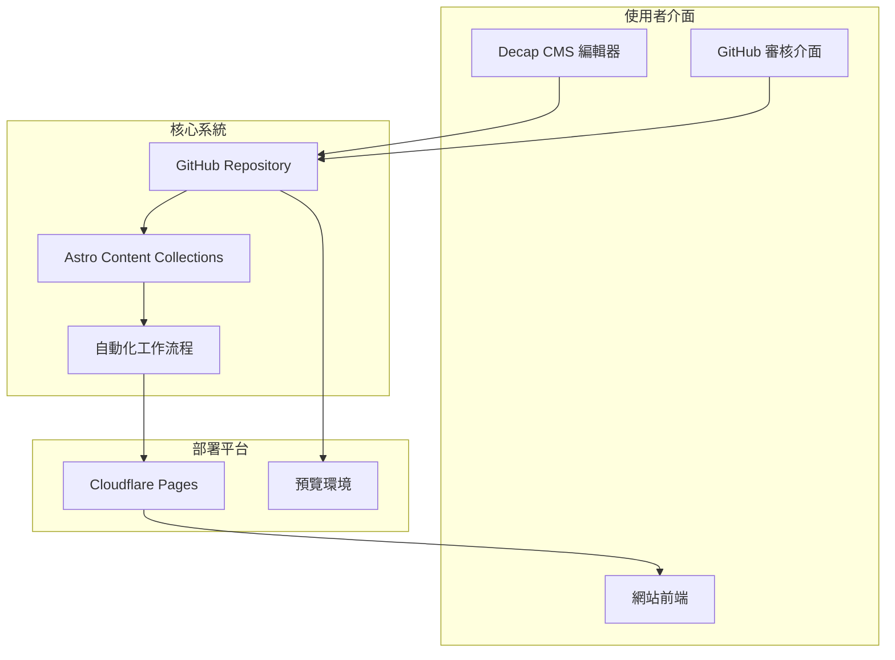

# 第一天：系統概覽和基本概念

## 學習目標

完成本日培訓後，學員將能夠：
- 理解衛教文章發布系統的整體架構
- 了解不同使用者角色和權限
- 熟悉基本的工作流程概念
- 掌握系統登入和基本導覽

## 培訓議程

### 上午場次（9:00-12:00）

#### 1. 歡迎和介紹（30分鐘）
- 培訓目標和期望
- 學員自我介紹
- 培訓時程安排

#### 2. 系統概覽（60分鐘）
- 系統設計理念和目標
- 技術架構簡介
- 主要功能模組
- 與現有系統的整合

#### 3. 使用者角色和權限（60分鐘）
- 內容撰寫者角色
- 審核者角色
- 管理者角色
- 權限管理機制

#### 4. 休息（15分鐘）

### 下午場次（13:00-17:00）

#### 5. 工作流程概念（90分鐘）
- Git 版本控制基礎
- Pull Request 審核流程
- 內容狀態管理
- 自動化品質檢查

#### 6. 系統登入和導覽（60分鐘）
- GitHub 帳號設定
- Decap CMS 登入流程
- 介面導覽和基本操作
- 常用功能介紹

#### 7. 實作練習（60分鐘）
- 登入系統
- 瀏覽現有內容
- 熟悉介面操作
- 問題討論

#### 8. 總結和問答（15分鐘）

## 詳細內容

### 系統架構說明

### 使用者角色詳解

#### 內容撰寫者
**主要職責：**
- 撰寫和編輯衛教文章
- 使用 Decap CMS 進行內容管理
- 回應審核意見並修改內容
- 維護內容的時效性和準確性

**所需技能：**
- 醫學專業知識
- 基本的電腦操作能力
- 文字撰寫和編輯能力
- 學習新工具的意願

#### 審核者
**主要職責：**
- 審核文章的醫學準確性
- 檢查內容結構和可讀性
- 提供建設性的修改建議
- 確保內容符合發布標準

**所需技能：**
- 相關專科的專業知識
- 批判性思維能力
- 溝通和回饋技巧
- GitHub 基本操作能力

#### 系統管理者
**主要職責：**
- 管理使用者帳號和權限
- 監控系統運行狀態
- 處理技術問題和故障
- 協調工作流程和政策

**所需技能：**
- 技術系統管理經驗
- 專案管理能力
- 問題解決技巧
- 跨團隊協作能力

### 工作流程概念

#### 基本工作流程
1. **內容創建**：撰寫者使用 CMS 建立新文章
2. **提交審核**：將文章狀態改為「審核中」
3. **專業審核**：審核者檢查內容並提供意見
4. **修改完善**：撰寫者根據意見修改內容
5. **品質檢查**：系統自動進行品質驗證
6. **發布上線**：管理者批准後文章正式發布

#### 狀態管理
- **草稿（Draft）**：文章正在撰寫中
- **審核中（In Review）**：已提交專業審核
- **需要修改（Needs Revision）**：審核不通過，需要修改
- **品質檢查（Quality Check）**：自動品質驗證中
- **準備發布（Ready to Publish）**：等待最終發布
- **已發布（Published）**：文章已上線

### 實作練習指導

#### 練習1：系統登入
1. 開啟瀏覽器，前往 CMS 登入頁面
2. 使用提供的測試帳號登入
3. 熟悉主要介面元素
4. 嘗試切換不同的功能頁面

#### 練習2：內容瀏覽
1. 瀏覽現有的文章列表
2. 開啟一篇範例文章查看
3. 注意文章的狀態和元資料
4. 查看文章的版本歷史

#### 練習3：基本操作
1. 嘗試搜尋特定主題的文章
2. 使用篩選功能按專科分類
3. 查看自己的工作項目
4. 熟悉通知和提醒功能

## 評估檢查

### 知識檢查題目

1. 系統的主要技術架構包含哪些組件？
2. 內容撰寫者的主要職責是什麼？
3. 文章從草稿到發布需要經過哪些狀態？
4. GitHub 在整個工作流程中扮演什麼角色？
5. 如何區分不同專科的內容要求？

### 實作檢查項目

- [ ] 能夠成功登入系統
- [ ] 能夠導覽主要功能頁面
- [ ] 能夠搜尋和篩選內容
- [ ] 能夠查看文章詳細資訊
- [ ] 能夠理解文章狀態含義

## 作業和準備

### 今日作業
1. 閱讀系統使用者指南的相關章節
2. 熟悉自己角色的具體職責和要求
3. 準備明天的 CMS 操作練習

### 明日準備
- 確保能夠正常登入系統
- 準備一個想要撰寫的文章主題
- 思考可能遇到的問題和挑戰

## 資源連結

- [系統使用者指南](../docs/USER_GUIDE.md)
- [撰寫者指南](../docs/WRITER_GUIDE.md)
- [審核者指南](../docs/REVIEWER_GUIDE.md)
- [管理者手冊](../docs/ADMIN_GUIDE.md)
- [故障排除指南](../docs/TROUBLESHOOTING.md)

## 聯繫資訊

- **培訓講師**：trainer@your-org.com
- **技術支援**：tech-support@your-org.com
- **課程問題**：training-questions@your-org.com