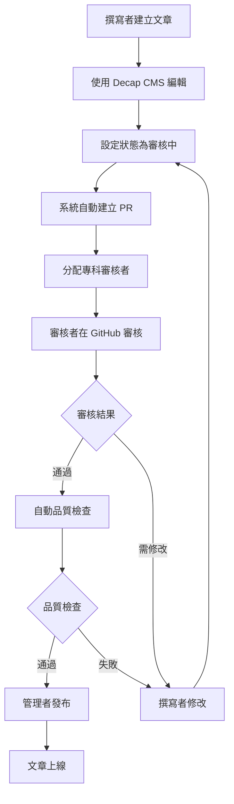

# 衛教文章發布系統使用指南

## 系統概述

本系統採用現代化的內容管理工作流程，結合 Decap CMS 視覺化編輯介面和 GitHub 版本控制系統，為醫療專業人員提供完整的衛教文章撰寫、審核和發布解決方案。

### 系統特色

- **視覺化編輯**：透過 Decap CMS 提供類似 WordPress 的編輯體驗
- **專業審核**：基於 GitHub Pull Request 的多層級審核機制
- **品質保證**：自動化品質檢查和醫療術語驗證
- **多語言支援**：支援繁體中文、英文、日文內容管理
- **即時預覽**：每個修改都有獨立的預覽環境

### 使用者角色

1. **內容撰寫者**：負責撰寫和編輯衛教文章
2. **專科審核者**：負責審核專科相關文章的醫療準確性
3. **醫學編輯**：負責內容結構、語言和格式審核
4. **系統管理者**：負責系統設定、使用者管理和發布控制

## 快速開始

### 第一次使用

1. **取得帳號權限**
   - 聯繫系統管理者申請帳號
   - 確認您的 GitHub 帳號已加入專案協作者
   - 取得 Decap CMS 登入權限

2. **登入系統**
   - 前往 [CMS 管理介面](/admin)
   - 使用 GitHub 帳號登入
   - 完成初次設定

3. **熟悉介面**
   - 瀏覽儀表板了解系統功能
   - 查看現有文章範例
   - 閱讀相關指南文件

### 系統需求

- **瀏覽器**：Chrome 90+、Firefox 88+、Safari 14+、Edge 90+
- **網路**：穩定的網際網路連線
- **帳號**：有效的 GitHub 帳號
- **權限**：專案協作者權限

## 導覽目錄

- [內容撰寫者指南](./WRITER_GUIDE.md) - 如何使用 Decap CMS 撰寫和編輯文章
- [審核者指南](./REVIEWER_GUIDE.md) - 如何在 GitHub 上進行文章審核
- [管理者手冊](./ADMIN_GUIDE.md) - 系統管理和設定指南
- [故障排除](./TROUBLESHOOTING.md) - 常見問題和解決方案
- [最佳實踐](./BEST_PRACTICES.md) - 內容撰寫和工作流程建議

## 工作流程概覽

## 支援與協助

### 技術支援

- **系統問題**：[建立 Issue](https://github.com/your-org/health-education-platform/issues)
- **使用諮詢**：聯繫系統管理者
- **緊急支援**：technical-support@your-org.com

### 培訓資源

- **新手教學**：[觀看教學影片](./training/videos/)
- **實作練習**：[練習環境](./training/sandbox/)
- **定期培訓**：每月第一個週三 14:00-16:00

### 意見回饋

我們重視您的使用體驗，歡迎提供改善建議：

- **功能建議**：[功能請求表單](https://forms.gle/your-form-id)
- **錯誤回報**：[錯誤回報表單](https://forms.gle/your-bug-report-form)
- **使用心得**：feedback@your-org.com

---

**版本資訊**：v1.0.0 | **最後更新**：2025年1月 | **維護團隊**：數位醫療團隊