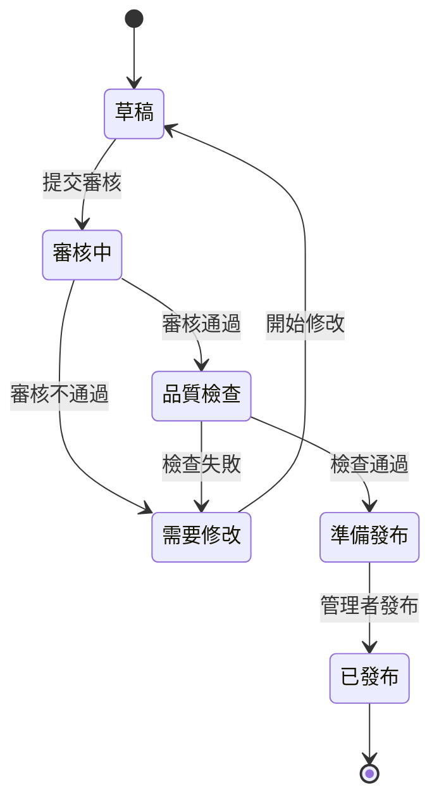

# 內容撰寫者指南

## Decap CMS 使用手冊

本指南將協助您學會使用 Decap CMS 撰寫和管理衛教文章。

## 目錄

1. [登入與基本操作](#登入與基本操作)
2. [建立新文章](#建立新文章)
3. [編輯現有文章](#編輯現有文章)
4. [專科特定功能](#專科特定功能)
5. [多語言內容管理](#多語言內容管理)
6. [媒體檔案管理](#媒體檔案管理)
7. [工作流程狀態](#工作流程狀態)
8. [預覽與發布](#預覽與發布)

## 登入與基本操作

### 首次登入

1. **前往 CMS 介面**
   - 開啟瀏覽器，前往 `https://your-domain.com/admin`
   - 點擊「使用 GitHub 登入」按鈕

2. **GitHub 授權**
   - 如果尚未登入 GitHub，請先登入您的 GitHub 帳號
   - 授權應用程式存取您的 GitHub 資料
   - 首次使用需要管理者審核權限

3. **介面導覽**
   ```
   ┌─────────────────────────────────────┐
   │ 🏠 儀表板  📝 文章管理  👥 審核狀態    │
   ├─────────────────────────────────────┤
   │                                     │
   │  📊 統計資訊                         │
   │  ├─ 我的文章: 12 篇                  │
   │  ├─ 待審核: 3 篇                     │
   │  └─ 已發布: 9 篇                     │
   │                                     │
   │  📋 最近活動                         │
   │  ├─ 心房顫動指南 - 審核中             │
   │  ├─ 糖尿病管理 - 已發布               │
   │  └─ 高血壓預防 - 草稿                │
   │                                     │
   └─────────────────────────────────────┘
   ```

### 儀表板功能

- **我的文章**：顯示您撰寫的所有文章
- **待審核文章**：需要您審核的文章（如果您也是審核者）
- **最近活動**：系統最新動態和通知
- **快速操作**：常用功能的快捷按鈕

## 建立新文章

### 步驟一：選擇文章類型

1. 點擊「📝 文章管理」→「➕ 建立新文章」
2. 選擇文章類型：
   - **一般衛教文章**：標準的衛教內容
   - **疾病指南**：特定疾病的完整指南
   - **預防保健**：預防性醫療資訊
   - **急救處理**：緊急醫療處理指南

### 步驟二：填寫基本資訊

```yaml
# 必填欄位
標題 (繁體中文): "心房顫動的診斷與治療"
標題 (英文): "Atrial Fibrillation: Diagnosis and Treatment"
專科分類: "心臟科"
難度等級: "中級"

# 選填欄位
標題 (日文): "心房細動の診断と治療"
摘要: "本文介紹心房顫動的症狀識別、診斷方法和治療選項"
標籤: ["心房顫動", "心律不整", "抗凝血治療"]
```

### 步驟三：選擇專科分類

選擇專科後，系統會自動：
- 載入專科特定的內容模板
- 顯示必要章節提示
- 設定專科特定的審核者
- 提供相關的檢查清單

**可用專科分類：**
- 心臟科 (Cardiology)
- 神經科 (Neurology)  
- 小兒科 (Pediatrics)
- 骨科 (Orthopedics)
- 急診科 (Emergency Medicine)

### 步驟四：撰寫內容

#### 使用富文本編輯器

編輯器提供以下功能：
- **格式化工具**：粗體、斜體、底線、刪除線
- **標題層級**：H1-H6 標題
- **清單**：有序和無序清單
- **連結**：內部連結和外部連結
- **圖片**：插入和編輯圖片
- **表格**：建立和編輯表格
- **程式碼**：程式碼區塊和行內程式碼

#### 內容結構建議

```markdown
# 文章標題

## 簡介
- 疾病/主題的基本介紹
- 為什麼這個主題重要

## 症狀識別
- 主要症狀
- 次要症狀
- 警示症狀

## 診斷方法
- 理學檢查
- 實驗室檢查
- 影像檢查

## 治療選項
- 藥物治療
- 非藥物治療
- 手術治療

## 預防措施
- 生活型態調整
- 定期追蹤
- 注意事項

## 參考資料
- 醫學文獻引用
- 相關指引
```

## 編輯現有文章

### 尋找文章

1. **使用搜尋功能**
   - 在搜尋框輸入關鍵字
   - 可搜尋標題、內容、標籤

2. **使用篩選器**
   - 按專科分類篩選
   - 按狀態篩選（草稿、審核中、已發布）
   - 按作者篩選

3. **排序選項**
   - 最近修改
   - 建立時間
   - 標題字母順序

### 編輯模式

點擊文章進入編輯模式，您可以：
- 修改任何內容欄位
- 上傳新的媒體檔案
- 調整文章設定
- 查看版本歷史

### 版本控制

系統會自動儲存您的修改：
- **自動儲存**：每 30 秒自動儲存草稿
- **手動儲存**：點擊「💾 儲存」按鈕
- **版本歷史**：查看所有修改記錄
- **版本比較**：比較不同版本的差異

## 專科特定功能

### 心臟科文章

**必要章節：**
- 症狀識別
- 診斷方法  
- 治療策略
- 預防措施

**特殊欄位：**
- 心律分類：正常/心律不整/心房顫動/心室顫動
- 風險分級：低風險/中風險/高風險
- 緊急程度：一般/緊急/極緊急

**檢查清單：**
- [ ] 是否包含心電圖解讀
- [ ] 是否提及藥物交互作用
- [ ] 是否包含生活型態建議
- [ ] 是否符合最新治療指引

### 小兒科文章

**必要章節：**
- 年齡分組
- 症狀描述
- 家長指導
- 緊急處理

**特殊欄位：**
- 適用年齡：新生兒/嬰兒/幼兒/學齡前/學齡
- 體重範圍：公斤數範圍
- 發展階段：相關發展里程碑

**檢查清單：**
- [ ] 是否包含年齡特定資訊
- [ ] 是否提供家長指導
- [ ] 是否包含劑量計算
- [ ] 是否提及安全注意事項

### 神經科文章

**必要章節：**
- 神經學檢查
- 影像診斷
- 治療方案
- 復健指導

**特殊欄位：**
- 神經功能評估：NIHSS/GCS/mRS
- 影像需求：CT/MRI/血管攝影
- 復健類型：物理/職能/語言治療

**檢查清單：**
- [ ] 是否包含神經學檢查步驟
- [ ] 是否說明影像判讀要點
- [ ] 是否提供復健指導
- [ ] 是否包含預後評估

## 多語言內容管理

### 語言版本管理

系統支援三種語言：
- **繁體中文**：主要語言，必填
- **英文**：國際版本，建議填寫
- **日文**：選填，針對日語使用者

### 翻譯工作流程

1. **建立中文版本**
   - 完成繁體中文內容撰寫
   - 確保內容完整且準確

2. **新增英文版本**
   - 點擊「🌐 新增語言版本」
   - 選擇「English」
   - 翻譯所有必要欄位

3. **同步更新**
   - 修改主要語言版本時
   - 系統會提醒更新其他語言版本
   - 標記需要翻譯的內容

### 翻譯品質檢查

- **術語一致性**：使用統一的醫學術語
- **文化適應性**：考慮不同文化背景
- **長度適中**：避免翻譯過長或過短
- **專業審核**：建議由母語者審核

## 媒體檔案管理

### 支援的檔案格式

**圖片檔案：**
- JPG/JPEG（建議用於照片）
- PNG（建議用於圖表、截圖）
- WebP（現代格式，檔案較小）
- SVG（向量圖形）

**文件檔案：**
- PDF（參考資料、指引文件）

### 檔案大小限制

- **圖片檔案**：最大 5MB
- **PDF 檔案**：最大 10MB
- **總儲存空間**：每位使用者 100MB

### 上傳步驟

1. **點擊上傳按鈕**
   - 在編輯器中點擊「🖼️ 插入圖片」
   - 或拖拽檔案到編輯區域

2. **選擇檔案**
   - 從電腦選擇檔案
   - 或從媒體庫選擇現有檔案

3. **設定圖片資訊**
   ```yaml
   替代文字 (Alt Text): "心電圖顯示心房顫動的典型波形"
   標題: "心房顫動心電圖"
   說明: "12導程心電圖，顯示不規則的 R-R 間距"
   ```

### 圖片最佳化建議

- **解析度**：網頁用圖建議 72-150 DPI
- **尺寸**：寬度不超過 1200px
- **壓縮**：適度壓縮以減少載入時間
- **命名**：使用有意義的檔案名稱

## 工作流程狀態

### 狀態說明

文章在系統中有以下狀態：

1. **草稿 (Draft)**
   - 文章正在撰寫中
   - 只有作者可以查看和編輯
   - 不會出現在公開網站

2. **審核中 (In Review)**
   - 文章已提交審核
   - 審核者可以查看和評論
   - 作者無法直接編輯

3. **需要修改 (Needs Revision)**
   - 審核者要求修改
   - 作者可以查看審核意見
   - 修改後可重新提交審核

4. **品質檢查 (Quality Check)**
   - 通過人工審核
   - 系統進行自動品質檢查
   - 檢查醫學術語、格式等

5. **準備發布 (Ready to Publish)**
   - 通過所有檢查
   - 等待管理者最終發布
   - 內容已確定不會再修改

6. **已發布 (Published)**
   - 文章已在網站上線
   - 公眾可以瀏覽
   - 如需修改需要重新進入審核流程

### 狀態轉換



### 操作權限

| 狀態 | 作者可編輯 | 審核者可評論 | 管理者可發布 |
|------|-----------|-------------|-------------|
| 草稿 | ✅ | ❌ | ❌ |
| 審核中 | ❌ | ✅ | ❌ |
| 需要修改 | ✅ | ✅ | ❌ |
| 品質檢查 | ❌ | ❌ | ❌ |
| 準備發布 | ❌ | ❌ | ✅ |
| 已發布 | ❌ | ❌ | ✅ |

## 預覽與發布

### 預覽功能

1. **即時預覽**
   - 在編輯器右側查看即時預覽
   - 支援桌面和行動版本預覽
   - 可切換不同語言版本

2. **獨立預覽頁面**
   - 點擊「👁️ 預覽」開啟新分頁
   - 完整的網站樣式預覽
   - 可分享給其他人查看

3. **審核預覽**
   - 提交審核後自動產生預覽連結
   - 審核者可透過連結查看文章
   - 包含審核工具和評論功能

### 提交審核

1. **檢查必要欄位**
   - 確保所有必填欄位已完成
   - 檢查內容是否符合專科要求
   - 驗證圖片和連結是否正常

2. **自我檢查清單**
   - [ ] 標題清楚且吸引人
   - [ ] 內容結構完整
   - [ ] 醫學資訊準確
   - [ ] 語言通順易懂
   - [ ] 圖片清晰且相關
   - [ ] 參考資料完整

3. **提交步驟**
   - 將狀態改為「審核中」
   - 填寫提交說明（選填）
   - 點擊「📤 提交審核」
   - 系統自動通知審核者

### 審核過程追蹤

提交審核後，您可以：
- 查看審核進度
- 接收審核通知
- 查看審核者評論
- 回應審核意見

## 常見問題

### 編輯相關

**Q: 為什麼我無法編輯某篇文章？**
A: 可能原因：
- 文章正在審核中
- 您沒有編輯權限
- 文章已被其他人鎖定編輯

**Q: 如何復原誤刪的內容？**
A: 
- 使用瀏覽器的復原功能 (Ctrl+Z)
- 查看版本歷史，回復到先前版本
- 聯繫管理者協助復原

**Q: 上傳的圖片為什麼顯示不正常？**
A: 檢查項目：
- 檔案格式是否支援
- 檔案大小是否超過限制
- 網路連線是否穩定
- 瀏覽器是否支援該格式

### 審核相關

**Q: 審核需要多長時間？**
A: 
- 一般文章：3-5 個工作天
- 複雜文章：5-7 個工作天
- 緊急文章：1-2 個工作天（需特別標註）

**Q: 如何加速審核流程？**
A: 
- 確保內容完整且準確
- 遵循專科特定要求
- 主動回應審核意見
- 與審核者保持良好溝通

**Q: 審核被拒絕怎麼辦？**
A: 
- 仔細閱讀審核意見
- 逐項修改指出的問題
- 如有疑問可聯繫審核者
- 修改完成後重新提交

### 技術問題

**Q: 系統運行緩慢怎麼辦？**
A: 
- 檢查網路連線速度
- 清除瀏覽器快取
- 關閉不必要的瀏覽器分頁
- 嘗試重新整理頁面

**Q: 無法登入系統？**
A: 
- 確認 GitHub 帳號狀態正常
- 檢查是否有專案存取權限
- 清除瀏覽器 Cookie
- 聯繫管理者檢查帳號狀態

## 聯繫支援

如果您遇到本指南未涵蓋的問題，請透過以下方式尋求協助：

- **技術問題**：tech-support@your-org.com
- **內容諮詢**：content-team@your-org.com  
- **緊急支援**：+886-2-xxxx-xxxx
- **線上文件**：https://docs.your-org.com

---

**指南版本**：v1.0.0 | **最後更新**：2025年1月 | **適用系統版本**：v1.0.0+