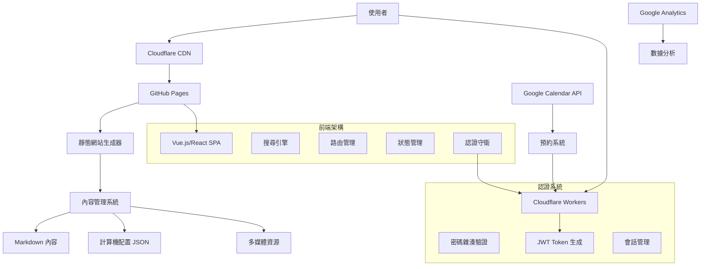
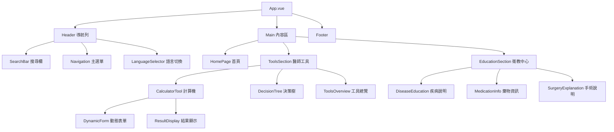

# ENT-clinic Pro 臨床決策與衛教平台 - 設計文件

## 概述

ENT-clinic Pro 是一個專為醫療專業人員設計的整合式數位平台，結合了臨床決策工具和病患衛教功能。平台採用現代化的單頁應用程式 (SPA) 架構，以 GitHub Pages 為主機，提供快速、可靠且易於維護的服務。

## 架構

### 系統架構



### 技術棧

- **前端框架**: Vue.js 3 或 React 18 (建議 Vue.js 因其學習曲線較平緩)
- **建構工具**: Vite
- **CSS 框架**: Tailwind CSS (提供快速響應式設計)
- **搜尋引擎**: Fuse.js (客戶端全文搜尋)
- **圖表庫**: Chart.js 或 D3.js (用於數據視覺化)
- **圖示**: Heroicons 或 Lucide (醫療相關圖示)
- **認證系統**: JWT + Cloudflare Workers (無伺服器認證)
- **密碼雜湊**: bcrypt.js (客戶端密碼處理)
- **部署**: GitHub Actions + GitHub Pages
- **CDN**: Cloudflare

## 元件與介面

### 核心元件架構



### 使用者介面設計

#### 醫師端介面設計原則

- **功能優先**: 清晰的資訊層級，最小化視覺干擾
- **高資訊密度**: 在有限空間內展示最多有用資訊
- **快速存取**: 常用功能一鍵可達
- **專業外觀**: 類似醫療儀器的簡潔設計

#### 病患端介面設計原則

- **清晰易懂**: 大量留白，柔和色彩
- **視覺化優先**: 圖表、流程圖、比較表
- **消除恐懼**: 友善的圖示和說明文字
- **大字體**: 適合各年齡層閱讀

### 響應式設計斷點

```css
/* 手機 */
@media (max-width: 640px) {
  /* 單欄布局，簡化導航 */
}

/* 平板 */
@media (min-width: 641px) and (max-width: 1024px) {
  /* 雙欄布局，保持主要功能 */
}

/* 桌面 */
@media (min-width: 1025px) {
  /* 完整功能，多欄布局 */
}
```

## 安全認證架構

### Cloudflare Workers 認證服務

為了確保預約系統的安全性，同時滿足 GitHub Pages 部署的需求，我們採用 Cloudflare Workers 作為無伺服器認證服務：

```javascript
// Cloudflare Worker 認證邏輯
export default {
  async fetch(request, env) {
    const url = new URL(request.url)

    if (url.pathname === '/api/auth') {
      return handleAuth(request, env)
    }

    if (url.pathname === '/api/verify') {
      return handleVerify(request, env)
    }

    return new Response('Not Found', { status: 404 })
  }
}

async function handleAuth(request, env) {
  const { password } = await request.json()

  // 使用環境變數中的雜湊密碼進行比對
  const hashedPassword = await hashPassword(password)

  if (hashedPassword === env.HASHED_PASSWORD) {
    // 生成 JWT token
    const token = await generateJWT(
      {
        authenticated: true,
        exp: Math.floor(Date.now() / 1000) + 60 * 60 // 1小時過期
      },
      env.JWT_SECRET
    )

    return new Response(
      JSON.stringify({
        success: true,
        token
      }),
      {
        headers: { 'Content-Type': 'application/json' }
      }
    )
  }

  return new Response(
    JSON.stringify({
      success: false
    }),
    {
      status: 401,
      headers: { 'Content-Type': 'application/json' }
    }
  )
}
```

### 前端認證整合

```javascript
// 前端認證服務
class AuthService {
  constructor() {
    this.token = localStorage.getItem('auth_token')
    this.isAuthenticated = false
  }

  async login(password) {
    try {
      const response = await fetch('https://your-worker.your-subdomain.workers.dev/api/auth', {
        method: 'POST',
        headers: {
          'Content-Type': 'application/json'
        },
        body: JSON.stringify({ password })
      })

      const data = await response.json()

      if (data.success) {
        this.token = data.token
        localStorage.setItem('auth_token', this.token)
        this.isAuthenticated = true
        return true
      }

      return false
    } catch (error) {
      console.error('Authentication error:', error)
      return false
    }
  }

  async verifyToken() {
    if (!this.token) return false

    try {
      const response = await fetch('https://your-worker.your-subdomain.workers.dev/api/verify', {
        method: 'POST',
        headers: {
          Authorization: `Bearer ${this.token}`,
          'Content-Type': 'application/json'
        }
      })

      const data = await response.json()
      this.isAuthenticated = data.valid

      if (!data.valid) {
        this.logout()
      }

      return data.valid
    } catch (error) {
      console.error('Token verification error:', error)
      this.logout()
      return false
    }
  }

  logout() {
    this.token = null
    this.isAuthenticated = false
    localStorage.removeItem('auth_token')
  }
}
```

### 路由守衛

```javascript
// Vue Router 守衛
router.beforeEach(async (to, from, next) => {
  if (to.path.startsWith('/booking')) {
    const authService = new AuthService()
    const isAuthenticated = await authService.verifyToken()

    if (!isAuthenticated) {
      next('/login')
    } else {
      next()
    }
  } else {
    next()
  }
})
```

### 安全特性

1. **密碼不存在前端程式碼**: 所有密碼驗證都在 Cloudflare Workers 中進行
2. **環境變數保護**: 實際密碼雜湊值存儲在 Cloudflare Workers 的環境變數中
3. **JWT Token**: 使用短期有效的 JWT token 進行會話管理
4. **自動過期**: Token 會在 1 小時後自動過期
5. **HTTPS 加密**: 所有通訊都通過 HTTPS 進行加密

## 資料模型

### 計算機工具資料結構

```json
{
  "id": "cha2ds2-vasc",
  "name": {
    "zh-TW": "CHA₂DS₂-VASc 評分",
    "en": "CHA₂DS₂-VASc Score",
    "ja": "CHA₂DS₂-VASc スコア"
  },
  "category": "cardiology",
  "description": {
    "zh-TW": "評估心房顫動患者中風風險",
    "en": "Assess stroke risk in atrial fibrillation patients",
    "ja": "心房細動患者の脳卒中リスクを評価"
  },
  "fields": [
    {
      "id": "age",
      "type": "select",
      "label": {
        "zh-TW": "年齡",
        "en": "Age",
        "ja": "年齢"
      },
      "options": [
        {
          "value": 0,
          "label": { "zh-TW": "< 65歲", "en": "< 65 years", "ja": "< 65歳" }
        },
        {
          "value": 1,
          "label": { "zh-TW": "65-74歲", "en": "65-74 years", "ja": "65-74歳" }
        },
        {
          "value": 2,
          "label": { "zh-TW": "≥ 75歲", "en": "≥ 75 years", "ja": "≥ 75歳" }
        }
      ]
    }
  ],
  "calculation": "age + gender + chf + hypertension + stroke + vascular + diabetes",
  "interpretation": [
    {
      "range": [0, 0],
      "risk": "low",
      "recommendation": {
        "zh-TW": "無需抗凝治療",
        "en": "No anticoagulation",
        "ja": "抗凝固療法不要"
      }
    },
    {
      "range": [1, 1],
      "risk": "moderate",
      "recommendation": {
        "zh-TW": "考慮抗凝治療",
        "en": "Consider anticoagulation",
        "ja": "抗凝固療法を検討"
      }
    },
    {
      "range": [2, 9],
      "risk": "high",
      "recommendation": {
        "zh-TW": "建議抗凝治療",
        "en": "Recommend anticoagulation",
        "ja": "抗凝固療法を推奨"
      }
    }
  ]
}
```

### 衛教內容資料結構

```json
{
  "id": "atrial-fibrillation-education",
  "title": {
    "zh-TW": "心房顫動衛教",
    "en": "Atrial Fibrillation Education",
    "ja": "心房細動の患者教育"
  },
  "category": "cardiology",
  "tags": ["heart", "arrhythmia", "stroke-prevention"],
  "content": {
    "zh-TW": "markdown content in Traditional Chinese",
    "en": "markdown content in English",
    "ja": "markdown content in Japanese"
  },
  "media": [
    {
      "type": "image",
      "src": "/images/af-diagram.svg",
      "alt": {
        "zh-TW": "心房顫動示意圖",
        "en": "Atrial Fibrillation Diagram",
        "ja": "心房細動の図"
      }
    },
    {
      "type": "video",
      "src": "/videos/af-explanation.mp4",
      "thumbnail": "/images/af-video-thumb.jpg"
    }
  ],
  "relatedTools": ["cha2ds2-vasc", "hasbled"],
  "lastUpdated": "2024-01-15"
}
```

### 使用者偏好設定

```json
{
  "language": "zh-TW",
  "favoriteTools": ["cha2ds2-vasc", "drug-dosage-calc"],
  "recentlyUsed": [
    { "id": "cha2ds2-vasc", "timestamp": "2024-01-15T10:30:00Z" },
    { "id": "af-education", "timestamp": "2024-01-15T10:25:00Z" }
  ],
  "customDashboard": {
    "quickAccess": ["search", "calculator-overview", "education-center"],
    "layout": "grid"
  }
}
```

## 錯誤處理

### 錯誤類型與處理策略

#### 網路錯誤

- **離線狀態**: 顯示快取內容，標示離線狀態
- **載入失敗**: 提供重試按鈕，降級到基本功能
- **API 錯誤**: 顯示友善錯誤訊息，提供替代方案

#### 輸入驗證錯誤

- **即時驗證**: 在使用者輸入時提供即時回饋
- **錯誤高亮**: 清楚標示錯誤欄位
- **建議修正**: 提供具體的修正建議

#### 系統錯誤

- **錯誤邊界**: React/Vue 錯誤邊界捕獲未處理錯誤
- **錯誤報告**: 自動收集錯誤資訊用於改善
- **優雅降級**: 確保核心功能在部分功能失效時仍可使用

```javascript
// 錯誤處理範例
class ErrorHandler {
  static handleCalculationError(error, calculatorId) {
    console.error(`Calculator ${calculatorId} error:`, error)

    // 顯示使用者友善的錯誤訊息
    this.showUserMessage({
      type: 'error',
      title: '計算錯誤',
      message: '計算過程中發生錯誤，請檢查輸入值或稍後再試',
      actions: [
        { label: '重試', action: () => this.retryCalculation(calculatorId) },
        {
          label: '回報問題',
          action: () => this.reportIssue(error, calculatorId)
        }
      ]
    })
  }

  static handleNetworkError(error) {
    if (!navigator.onLine) {
      this.showOfflineMode()
    } else {
      this.showNetworkErrorMessage()
    }
  }
}
```

## 測試策略

### 單元測試

- **計算機邏輯**: 測試所有計算公式的正確性
- **資料驗證**: 測試輸入驗證邏輯
- **工具函數**: 測試搜尋、過濾、排序等功能

### 整合測試

- **API 整合**: 測試 Google Calendar 整合
- **路由測試**: 測試 SPA 路由功能
- **狀態管理**: 測試應用程式狀態變化

### 端到端測試

- **使用者流程**: 測試完整的使用者操作流程
- **跨瀏覽器**: 確保在主要瀏覽器中正常運作
- **響應式測試**: 測試不同螢幕尺寸的表現

### 效能測試

- **載入速度**: 確保頁面在 2 秒內載入完成
- **搜尋效能**: 確保搜尋在 1 秒內回應
- **記憶體使用**: 監控長時間使用的記憶體洩漏

### 可用性測試

- **醫師使用者測試**: 邀請醫師測試工具的實用性
- **病患理解度測試**: 測試衛教內容的易懂程度
- **無障礙測試**: 確保符合 WCAG 2.1 AA 標準

```javascript
// 測試範例
describe('CHA2DS2-VASc Calculator', () => {
  test('should calculate correct score for high-risk patient', () => {
    const input = {
      age: 2, // ≥75 years
      gender: 0, // male
      chf: 1,
      hypertension: 1,
      stroke: 2,
      vascular: 1,
      diabetes: 1
    }

    const result = calculateCHA2DS2VASc(input)
    expect(result.score).toBe(8)
    expect(result.risk).toBe('high')
    expect(result.recommendation).toContain('建議抗凝治療')
  })
})
```

### 測試自動化

- **持續整合**: GitHub Actions 自動執行測試
- **程式碼覆蓋率**: 維持 80% 以上的測試覆蓋率
- **效能監控**: 自動監控關鍵效能指標
- **可用性監控**: 定期檢查網站可用性

這個設計文件提供了 ENT-clinic Pro 平台的完整技術架構和實作指南，確保能夠滿足醫療專業人員和病患的需求，同時保持高效能和易維護性。
